## Allure 测试报告

**知识点梳理**

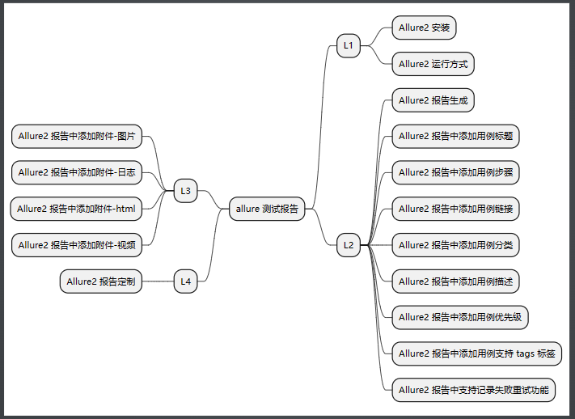

**实战思路**

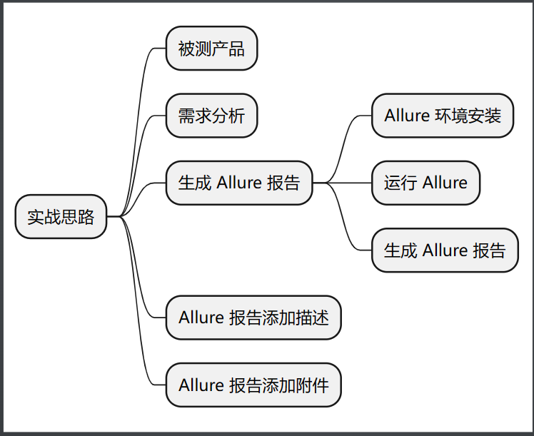

### Allure2 介绍
* Allure 是由 Java 语⾔开发的⼀个轻量级，灵活的测试报告⼯具。
* Allure 多平台的 Report 框架。
* Allure ⽀持多语⾔，包括 python、JaveScript、PHP、Ruby 等。
* 可以为开发/测试/管理等人员提供详尽的的测试报告，包括测试类别、测试步骤、日志、图片、视频等。
* 可以为管理层提供高水准的统计报告。
* 可以集成到 Jenkins 生成在线的趋势汇总报告

**Allure2 报告展示 - 首页概览**
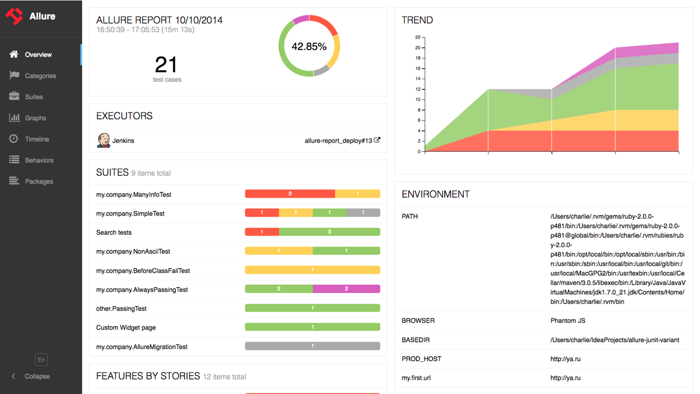
**Allure2 报告展示 - 用例详情页**
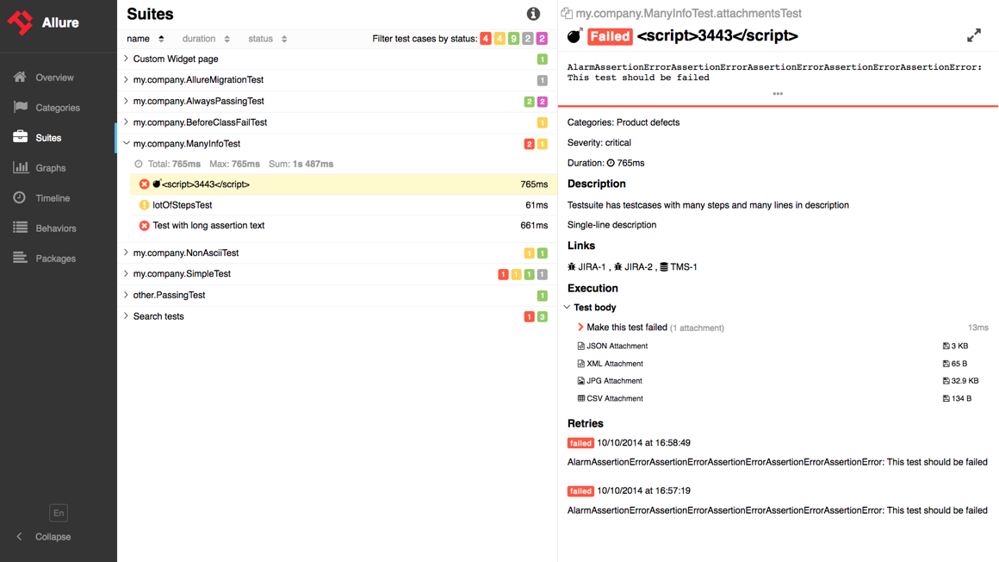
### Allure2 报告生成
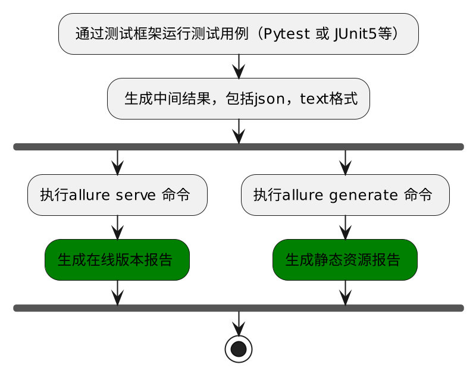
**使用 Allure2 生成精美报告**
* 生成测试报告需要使用命令行工具 allure
* 命令格式：
`allure [option] [command] [command options]`
```angular2html
# 步骤一：在测试执行期间收集结果
# —alluredir这个选项 用于指定存储测试结果的路径
pytest  [测试文件] -s –q --alluredir=./result/
# 如果要清除已经生成的报告的历史记录，可以添加参数--clean-alluredir
pytest  [测试文件] -s –q --alluredir=./result/ --clean-alluredir
# 步骤二：查看测试报告，注意这里的serve书写
allure serve ./result/
```
**Allure 报告生成的两种方式**
* 方式一：在线报告，会直接打开默认浏览器展示当前报告。
```angular2html
# 方式一：测试完成后查看实际报告，在线查看报告，会直接打开默认浏览器展示当前报告。
allure serve ./result/   (注意这里的serve书写)
```
* 方式二：静态资源文件报告(带 index.html、css、js 等文件)，需要将报告布署到 web 服务器上。
  * 应用场景：如果希望随时打开报告，可以生成一个静态资源文件报告，将这个报告布署到 web 服务器上，启动 web 服务，即可随时随地打开报告。
  * 解决方案：使用allure generate 生成带有 index.html 的结果报告。这种方式需要两个步骤：
    * 第一步：生成报告。
    * 第二步：打开报告。
```angular2html
# 生成报告
allure generate ./result
# 打开报告
allure open ./report/
```
**常用参数**
* allure generate 可以指定输出路径，也可以清理上次的报告记录。
  * -o / –output 输出报告的路径。
  * -c / –clean 如果报告路径重复。
* allure open 打开报告。
  * -h / –host 主机 IP 地址，此主机将用于启动报表的 web 服务器。
  * -p / –port 主机端口，此端口将用于启动报表的 web 服务器，默认值：0。
```angular2html
# 生成报告，指定输出路径，清理报告。
allure generate ./result -o ./report --clean

# 打开报告，指定IP地址和端口。
allure open -h 127.0.0.1 -p 8883 ./report/
```
### Allure 报告添加描述

#### Allure2报告中添加用例标题

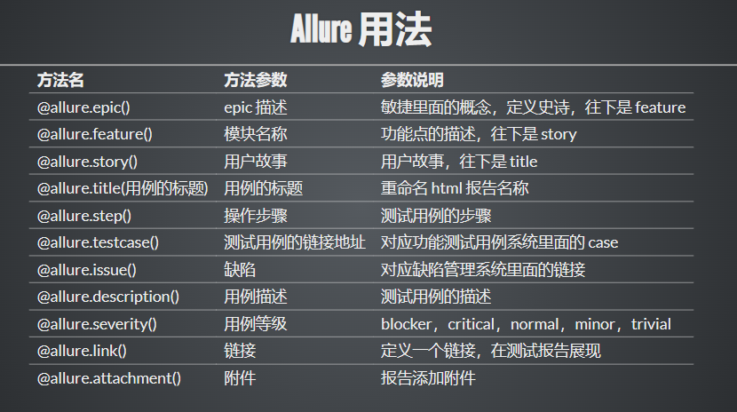

应用场景：为了让生成的测试报告便于阅读，可以为每条用例添加一个便于阅读的标题（可以使用中文标题）。生成的报告展示用例时，就会以设置的标题名展示出来。

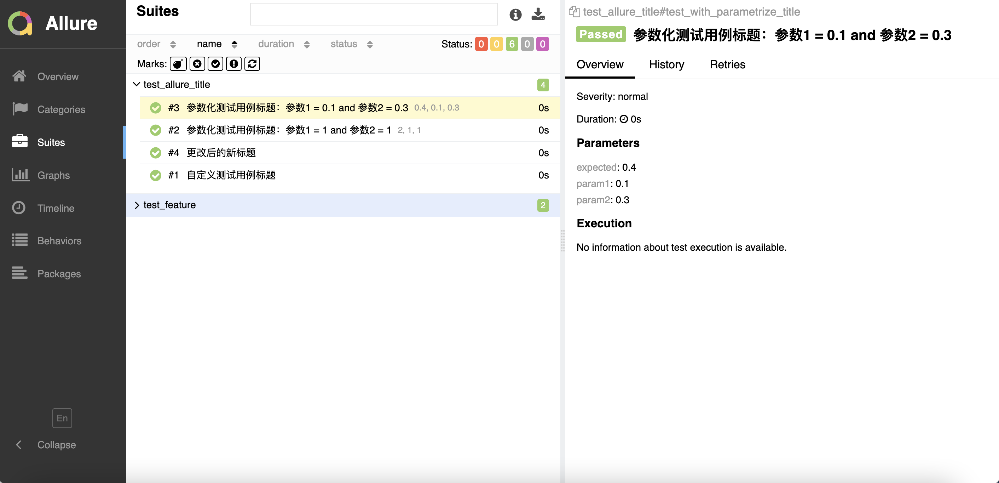
* 通过使用装饰器 @allure.title 可以为测试用例自定义一个可阅读性的标题。
* allure.title 的三种使用方式：
  1. 直接使用 @allure.title 为测试用例自定义标题。
  2. @allure.title 支持通过占位符的方式传递参数，可以实现测试用例标题参数化，动态生成测试用例标题。
  3. allure.dynamic.title 动态更新测试用例标题。

方法一：直接使用装饰器
```angular2html

import allure
import pytest

@allure.title("自定义测试用例标题")
def test_with_title():
    assert True
```
方式二：通过占位符的方式传递参数，可以实现测试用例标题参数化，动态生成测试用例标题。
```angular2html
import allure
import pytest

@allure.title("参数化用例标题：参数一：{param1} ，参数二： {param2}")
@pytest.mark.parametrize("param1, param2, expected", [
    (1, 1, 2),
    (0.1, 0.3, 0.4)
])
def test_with_parametrize_title(param1, param2, expected):
    assert param1 + param2 == expected
```
方式三：动态更新测试用例标题。
```angular2html
@allure.title("原始标题")
def test_with_dynamic_title():
    assert True
    allure.dynamic.title("更改后的新标题")
```

#### Allure2 报告中添加用例步骤

应用场景：编写自动化测试用例的时候经常会遇到需要编写流程性测试用例的场景，一般流程性的测试用例的测试步骤比较多，我们在测试用例中添加详细的步骤会提高测试用例的可阅读性。

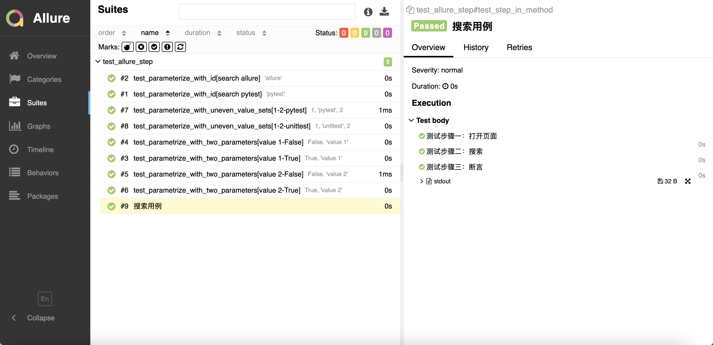
* Allure 支持两种方法：

* 方法一：使用装饰器定义一个测试步骤，在测试用例中使用。
```angular2html
# 方法一：使用装饰器定义一个测试步骤，在测试用例中使用
import allure
import pytest

@allure.step
def simple_step1(step_param1, step_param2 = None):
    '''定义一个测试步骤'''
    print(f"步骤1：打开页面，参数1: {step_param1}, 参数2：{step_param2}")

@allure.step
def simple_step2(step_param):
    '''定义一个测试步骤'''
    print(f"步骤2：完成搜索 {step_param} 功能")

@pytest.mark.parametrize('param1', ["pytest", "allure"], ids=['search pytest', 'search allure'])
def test_parameterize_with_id(param1):
    simple_step2(param1)


@pytest.mark.parametrize('param1', [True, False])
@pytest.mark.parametrize('param2', ['value 1', 'value 2'])
def test_parametrize_with_two_parameters(param1, param2):
    simple_step1(param1, param2)

@pytest.mark.parametrize('param2', ['pytest', 'unittest'])
@pytest.mark.parametrize('param1,param3', [[1,2]])
def test_parameterize_with_uneven_value_sets(param1, param2, param3):
    simple_step1(param1, param3)
    simple_step2(param2)
```
  * 方法二：使用 with allure.step() 添加测试步骤。
```angular2html
# 方法二：使用 `with allure.step()` 添加测试步骤
@allure.title("搜索用例")
def test_step_in_method():
    with allure.step("测试步骤一：打开页面"):
        print("操作 a")
        print("操作 b")

    with allure.step("测试步骤二：搜索"):
        print("搜索操作 ")

    with allure.step("测试步骤三：断言"):
        assert True
```
#### Allure2报告中添加用例分类
* 应用场景：可以为项目，以及项目下的不同模块对用例进行分类管理。也可以运行某个类别下的用例。
* 报告展示：类别会展示在测试报告的 Behaviors 栏目下。
* Allure 提供了三个装饰器：
  * @allure.epic：敏捷里面的概念，定义史诗，往下是 feature。
  * @allure.feature：功能点的描述，理解成模块往下是 story。
  * @allure.story：故事 story 是 feature 的子集。

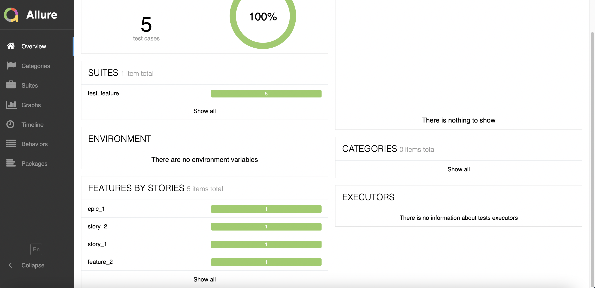

* 场景：希望在测试报告中看到用例所在的项目，需要用到 epic，相当于定义一个项目的需求，由于粒度比较大，在 epic 下面还要定义略小粒度的用户故事。
* 解决：@allure.epic
```angular2html
import allure

@allure.epic("需求1")
class TestEpic:
    def test_case1(self):
        print("用例1")

    def test_case2(self):
        print("用例2")

    def test_case3(self):
        print("用例3")
```
* 场景: 希望在报告中看到测试功能，子功能或场景。
* 解决: @allure.Feature、@allure.story
* 步骤：
  * 功能上加   @allure.feature('功能名称')
  * 子功能上加   @allure.story('子功能名称')
```angular2html
import allure

@allure.epic("需求1")
@allure.feature("功能模块1")
class TestEpic:
    @allure.story("子功能1")
    @allure.title("用例1")
    def test_case1(self):
        print("用例1")

    @allure.story("子功能2")
    @allure.title("用例2")
    def test_case2(self):
        print("用例2")

    @allure.story("子功能2")
    @allure.title("用例3")
    def test_case3(self):
        print("用例3")

    @allure.story("子功能1")
    @allure.title("用例4")
    def test_case4(self):
        print("用例4")
```
* allure 相关的命令查看 ： pytest --help|grep allure
* 通过指定命令行参数，运行 epic/feature/story 相关的用例：pytest 文件名 --allure-epics=EPICS_SET --allure-features=FEATURES_SET --allure-stories=STORIES_SET
```angular2html
# 只运行 epic 名为 "需求1" 的测试用例
pytest --alluredir ./results --clean-alluredir --allure-epics=需求1

# 只运行 feature 名为 "功能模块2" 的测试用例
pytest --alluredir ./results --clean-alluredir --allure-features=功能模块2

# 只运行 story 名为 "子功能1" 的测试用例
pytest --alluredir ./results --clean-alluredir --allure-stories=子功能1

# 运行 story 名为 "子功能1和子功能2" 的测试用例
pytest --alluredir ./results --clean-alluredir --allure-stories=子功能1,子功能2

# 运行 feature + story 的用例（取并集）
pytest --alluredir ./results --clean-alluredir --allure-features=功能模块1 --allure-stories=子功能1,子功能2
```
**Allure epic/feature/story 的关系**
* epic：敏捷里面的概念，用来定义史诗，相当于定义一个项目。
* feature：相当于一个功能模块，相当于 testsuite，可以管理很多个子分支 story。
* story：相当于对应这个功能或者模块下的不同场景，分支功能。
* epic 与 feature、feature 与 story 类似于父子关系。.

**Allure2报告中添加用例链接**

应用场景：将报告与 bug 管理系统或测试用例管理系统集成，可以添加链接装饰器 @allure.link、@allure.issue 和@allure.testcase。
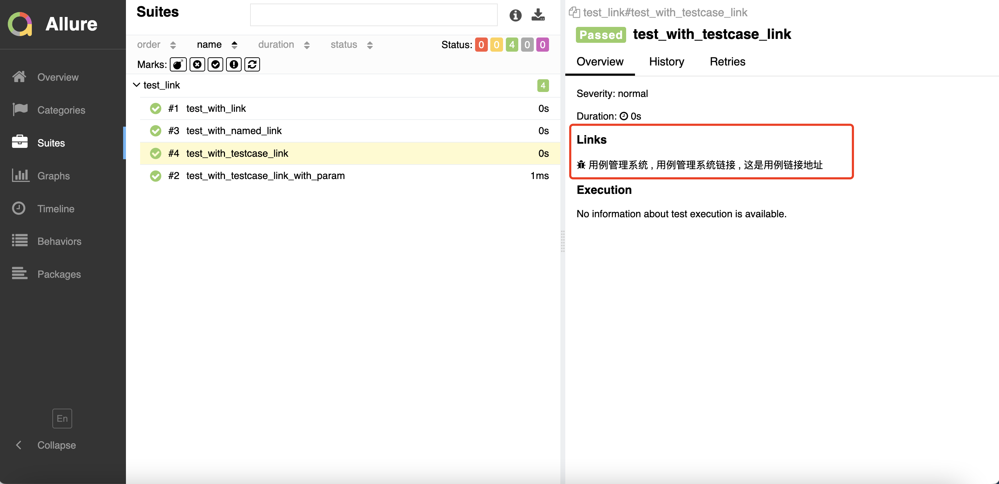
* 格式 1：@allure.link(url, name) 添加一个普通的 link 链接。
* 格式 2：@allure.testcase(url, name) 添加一个用例管理系统链接。
* 格式 3：@allure.issue(url, name)，添加 bug 管理系统链接。

```angular2html
# 格式1：添加一个普通的link 链接
@allure.link('https://ceshiren.com/t/topic/15860')
def test_with_link():
    pass

# 格式1：添加一个普通的link 链接，添加链接名称
@allure.link('https://ceshiren.com/t/topic/15860', name='这是用例链接地址')
def test_with_named_link():
    pass

# 格式2：添加用例管理系统链接
TEST_CASE_LINK = 'https://github.com/qameta/allure-integrations/issues/8#issuecomment-268313637'

@allure.testcase(TEST_CASE_LINK, '用例管理系统')
def test_with_testcase_link():
    pass

# 格式3：添加bug管理系统链接
# 这个装饰器在展示的时候会带 bug 图标的链接。可以在运行时通过参数 `--allure-link-pattern` 指定一个模板链接，以便将其与提供的问题链接类型链接模板一起使用。执行命令需要指定模板链接：`--allure-link-pattern=issue:https://ceshiren.com/t/topic/{}`
@allure.issue("15860", 'bug管理系统')
def test_with_issue():
    pass
```
#### Allure2 报告中添加用例描述
* 应用场景：Allure 支持往测试报告中对测试用例添加非常详细的描述语，用来描述测试用例详情。
* Allure 添加描述的四种方式：
  * 方式一：使用装饰器 @allure.description() 传递一个字符串参数来描述测试用例。
  * 方式二：使用装饰器 @allure.description_html 传递一段 HTML 文本来描述测试用例。
  * 方式三：直接在测试用例方法中通过编写文档注释的方法来添加描述。
  * 方式四：用例代码内部动态添加描述信息。

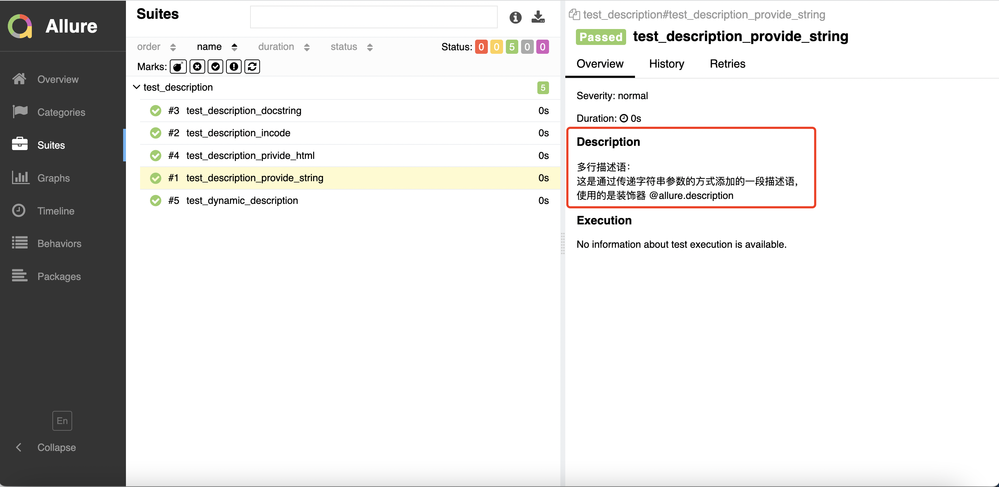
* 方式一：添加装饰器@allure.description()。
```angular2html
@allure.description("""
多行描述语：<br/>
这是通过传递字符串参数的方式添加的一段描述语，<br/>
使用的是装饰器 @allure.description
""")
def test_description_provide_string():
    assert True
```
* 方式二：添加装饰器@allure.description_html()
```angular2html
@allure.description_html("""html代码块""")
def test_description_privide_html():
    assert True
```
* 方式三：直接在代码中添加文档注释。
```angular2html
def test_description_docstring():
    """
    直接在测试用例方法中 </br>
    通过编写文档注释的方法 </br>
    来添加描述。 </br>
    :return:
    """
    assert True
```
* 方式四：代码中添加动态描述信息。
```angular2html
import allure

@allure.description("""这个描述将被替换""")
def test_dynamic_description():
    assert 42 == int(6 * 7)
    allure.dynamic.description('这是最终的描述信息')
    # allure.dynamic.description_html(''' html 代码块 ''')
```
#### Allure 报告添加附件
**应用场景**
* 应用场景：报告中添加详细的日志信息，有助于分析定位问题。
* 解决方案：使用 python 自带的 logging 模块生成日志，日志会自动添加到测试报告中。
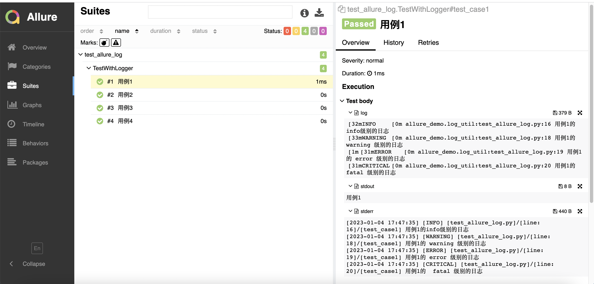

**Allure2 报告中添加日志**
```angular2html
# 根目录创建utils目录
# 创建一个日志模块： log_util.py
import logging
import os
from logging.handlers import RotatingFileHandler

# 绑定绑定句柄到logger对象
logger = logging.getLogger(__name__)
# 获取当前工具文件所在的路径
root_path = os.path.dirname(os.path.abspath(__file__))
# 拼接当前要输出日志的路径
log_dir_path = os.sep.join([root_path, '..', f'/logs'])
if not os.path.isdir(log_dir_path):
    os.mkdir(log_dir_path)
# 创建日志记录器，指明日志保存路径,每个日志的大小，保存日志的上限
file_log_handler = RotatingFileHandler(os.sep.join([log_dir_path, 'log.log']), maxBytes=1024 * 1024, backupCount=10)
# 设置日志的格式
date_string = '%Y-%m-%d %H:%M:%S'
formatter = logging.Formatter(
    '[%(asctime)s] [%(levelname)s] [%(filename)s]/[line: %(lineno)d]/[%(funcName)s] %(message)s ', date_string)
# 日志输出到控制台的句柄
stream_handler = logging.StreamHandler()
# 将日志记录器指定日志的格式
file_log_handler.setFormatter(formatter)
stream_handler.setFormatter(formatter)
# 为全局的日志工具对象添加日志记录器
# 绑定绑定句柄到logger对象
logger.addHandler(stream_handler)
logger.addHandler(file_log_handler)
# 设置日志输出级别
logger.setLevel(level=logging.INFO)
```

* 代码输出到用例详情页面。
* 运行用例：pytest --alluredir ./results --clean-alluredir（注意不要加-vs）。
```angular2html
@allure.feature("功能模块2")
class TestWithLogger:
    @allure.story("子功能1")
    @allure.title("用例1")
    def test_case1(self):
        logger.info("用例1的 info 级别的日志")
        logger.debug("用例1的 debug 级别的日志")
        logger.warning("用例1的 warning 级别的日志")
        logger.error("用例1的 error 级别的日志")
        logger.fatal("用例1的  fatal 级别的日志")
```
* 日志展示在 Test body 标签下，标签下可展示多个子标签代表不同的日志输出渠道：
  * log 子标签：展示日志信息。
  * stdout 子标签：展示 print 信息。
  * stderr 子标签：展示终端输出的信息。


**Allure2 报告中添加日志展示功能禁用**
* 禁用日志，可以使用命令行参数控制 --allure-no-capture

```angular2html
pytest --alluredir ./results --clean-alluredir --allure-no-capture
```

**python 日志模块**
* 日志作用
  * 调试 
  * 辅助定位问题 
  * 数据分析
* 日志的级别
  * 设置日志的级别`logging.basicConfig(level=logging.INFO)`
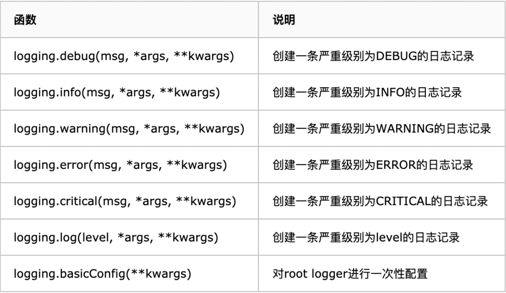
* 日志的用法 
  * 保存日志到文件`logging.basicConfig(filename='myapp.log', level=logging.INFO)`
  * 设置时间格式`logging.basicConfig(filename='myapp.log', level=logging.INFO,format='%(asctime)s [%(levelname)s] %(message)s (%(filename)s:%(lineno)s)', datefmt='%m/%d/%Y %I:%M:%S %p')` 