## 用户端App自动化测试

**知识点梳理**

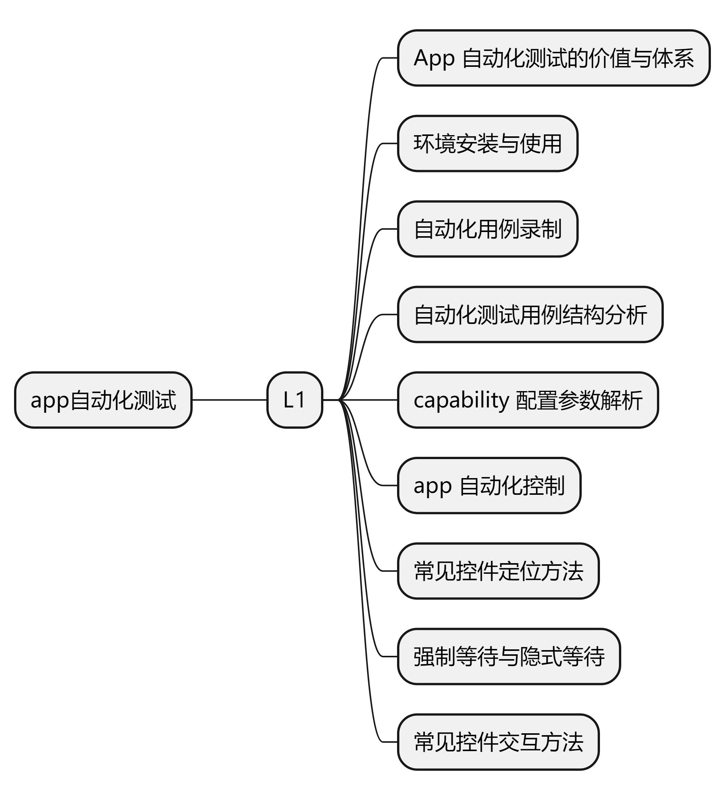

### 实战一目标

* 安装配置 Appium 环境。
* 掌握 Appium inspect 录制。
* 编写自动化测试用例

**相关知识点**

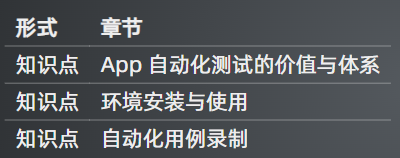

**UI 自动化价值**

* 提高效率
  * 融入企业迭代流水线，与 CI/CD/DevOps 结合
  * 回归测试、功能测试加速
* 提高质量：
  * 兼容性测试
  * 专项/非功能测试
  * 自动化探索测试

**app 测试的时代背景**

* 按月发布->按周发布->按小时发布
* 多端发布：Android、iOS、微信小程序、h5
* 多环境发布：联调环境、测试环境、预发布环境、线上环境
* 多机型发布：众多设备型号、众多系统版本
* 多版本共存：用户群体中存在多个不同的版本
* 历史回归测试任务：成百上千条业务用例如何回归

**技术选型**

* Appium
* Airtest
* 其他框架：calabash macaca atx
* iOS：KIF WDA XCUITest
* Android：Robotium Uiautomator2

**自动化测试框架选择**

* 推荐 Appium
  * 跨语言：Java、Python、nodejs 等
  * 跨平台
    * Andoid、iOS
    * Windows、Mac
  * 底层多引擎可切换
  * 生态丰富，社区强大
* iOS：KIF WDA XCTest
* Android：Robotium Uiautomator
* 其他框架：calabash macaca atx

**UI 自动化测试用例如何编写**

* 业务流程不频繁改动
* UI 元素不频繁改动
* 需要频繁回归的场景
* 核心场景等

**学习路线**

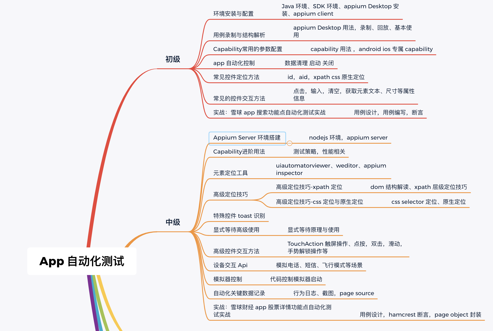
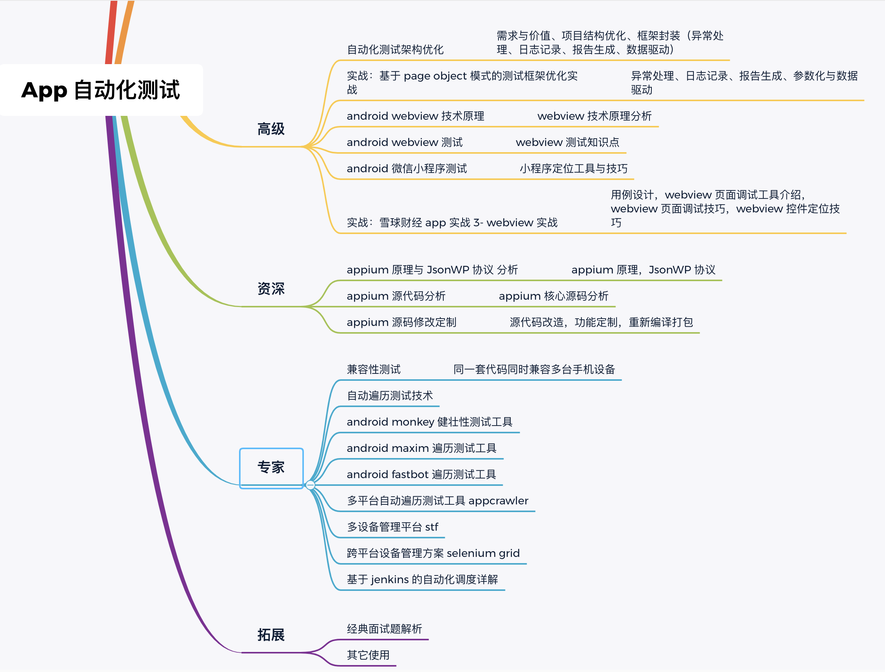

**目前 mobile 自动化解决方案**
* iOS:
  * calabash-ios
  * Frank
  * UIAutomation
  * ios-driver
  * KeepItFunctional
* Android:
  * calabash-android
  * MonkeyTalk
  * Robotium
  * UiAutomator
  * selendroid

**自动化工具选择**

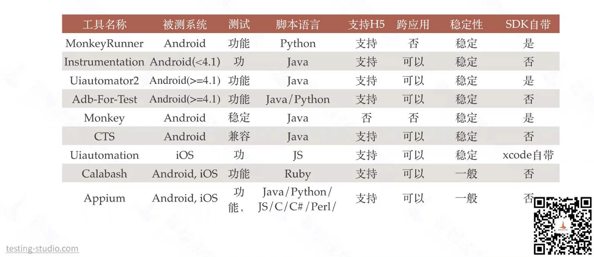

**自动化工具选择的取决因素**

* 单平台测试 or 多平台测试？
* 是否有多设备同时测试的场景？
* 不局限于测试环境，任何版本任何环境都可以测试？
* 最擅长哪种开发语言？
* 当前市面是否有满足项目需求的测试工具？是否需要二次开发？

### Appium

#### 介绍

Appium是一个移动端的自动化测试框架 ，可用于测试原生应用，移动网页应用和混合应用，且是跨平台的。可用于iOS和Android操作系统。原生应用是指用android或iOS编写的应用，移动网页应用是指网页应用，类似于iOS中safari应用或者Chrome应用或者类似浏览器的应用。混合应用是指一种包裹webview的应用，原生应用网页内容交互性的应用。重要的是Appium是跨平台的。何为跨平台，意思是可以针对不同平台用一套api来编写脚本。

#### Appium 框架介绍

* 推荐Appium原因：
  * 跨语言：Java、Python、nodejs等
  * 跨平台：
    * Android、iOS
    * Windows、Mac
  * 底层多引擎切换
  * 生态丰富，社区强大

#### Appium 引擎列表

* iOS
  * The XCUITest Driver（推荐）
  * (DEPRECATED)The UIAutomation Driver
* Android
  * (BETA)The Espresso Driver
  * The UiAutomator2 Driver（推荐）
  * (DEPRECATED) The UiAutomator Driver
  * (DEPRECATED) The Selendroid Driver
* Windows：The Windows Driver(for Windows Desktop apps)
* Mac：The Mac Driver(for Mac Desktop apps)

#### Appium 原理

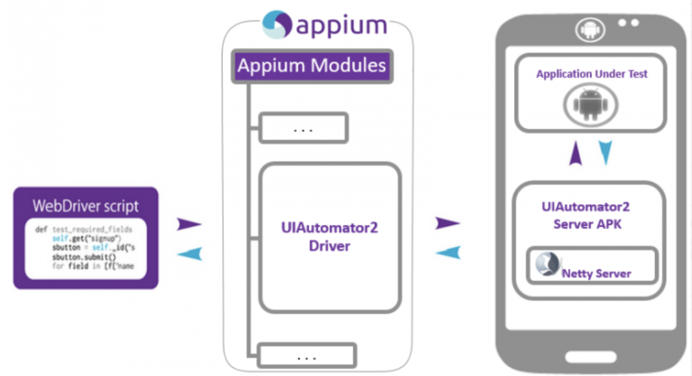

#### Appium 的设计理念

* webdriver是基于http协议的，第一连接会建立一个session会话，并通过post发送一个json告知服务端相关测试信息
* Client/Server设计模式
  * **客户端通过WebDriver json wire协议与服务端通讯**
  * 多语言支持
* Server可以放在任何地方
* 服务端NODEJS开发的HTTP服务
* appium使用appium-xcuitest-driver来测试iPhone设备，其中需要安装facebook出的WDA(webdriveragent)来驱动iOS测试

#### Appium 生态工具

* adb：android的控制工具，用于获取android的各种数据控制
* Appium Desktop：内嵌了appium server和inspecter的综合工具
* Appium Server：appium的核心工具，命令行工具
* Appium client：各种语言的客户端封装库，用于连接appium server
  * python、java、ruby、robotframework-appium
* AppCrawler自动遍历工具

### 自动化用例录制

#### Appium Inspctor 功能介绍

* UI 分析
* 录制用例
* 元素查找测试
* Attcah 已有的 session
* 云测试

#### 用例录制

* 获取 app 的信息
* 配置待测应用

#### 获取 app 的信息

* app 入口，两种方式获取：
  * 1、通过 logcat 日志获取
    * Mac/Linux: adb logcat ActivityManager:I | grep “cmp"
    * Windows: adb logcat ActivityManager:I | findstr "cmp"
  * 2、通过 aapt 获取
    * Mac/Linux: aapt dump badging wework.apk | grep launchable-activity
    * Windows: aapt dump badging wework.apk | findstr launchable-activity
* 启动应用命令 adb shell am start -W -n <package-name>/<activity-name> -S

#### 配置待测应用

* platformName：平台，Android/iOS
* deviceName：设备名
* appPackage：应用的包名
* appActivity：应用的页面名 Activity
* noReset: 防止清空缓存信息

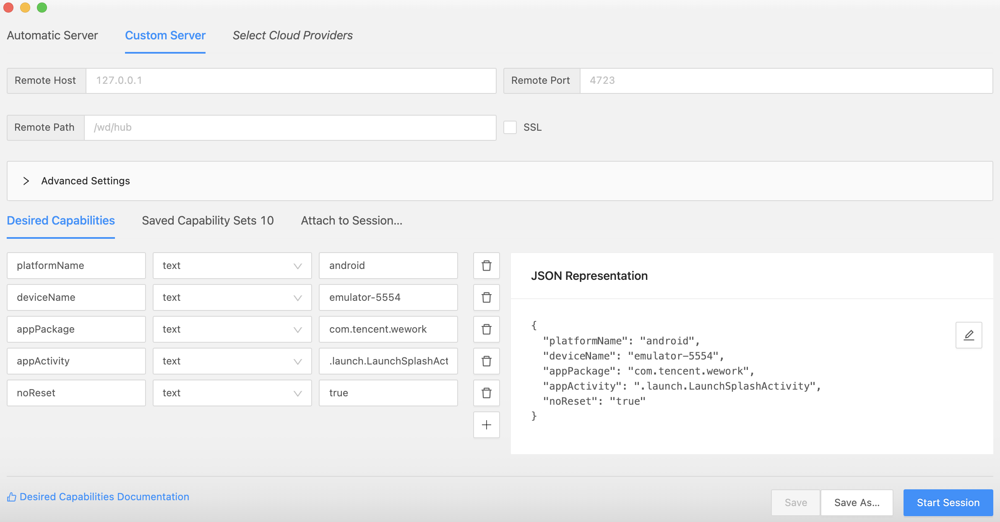

#### Appium inspector 页面结构

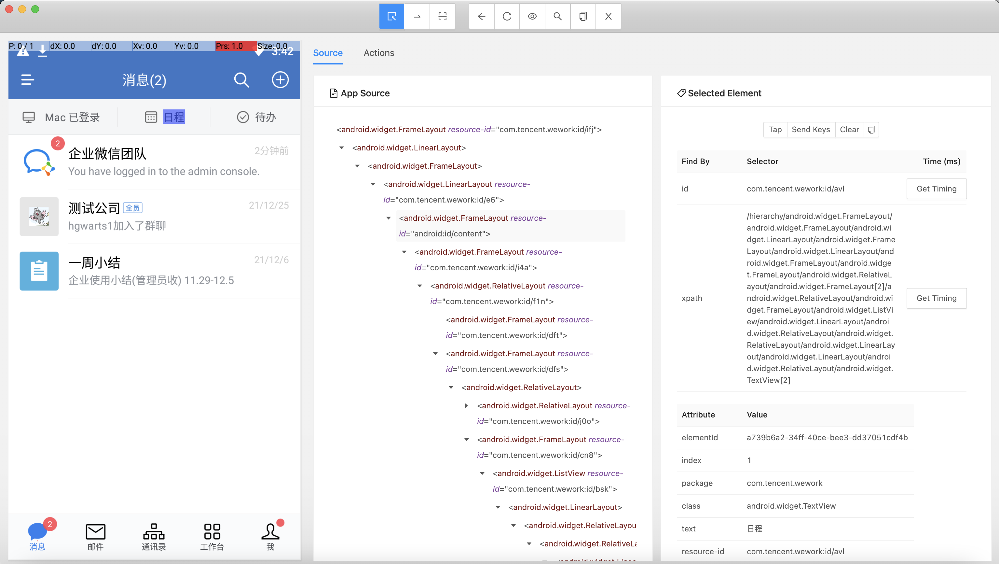

**功能键**

* SelectElements：选中元素，查看层级和属性
* Swipe By Coordinates：通过坐标点滑动
* Tap By Coordinates：通过坐标点点击
* Back：返回
* Refresh Source & Screenshot：刷新页面
* StartRecording：开始录制脚本
* Search for element：搜索元素
* Copy XML Source to Clipboard：复制 xml 结构
* Quit Session & Close Inspector：退出当前 Session

### 实战二目标

* 优化用例结构，改造成 Pytest 运行。
* 优化定位，将绝对定位优化成相对定位。
* 优化等待方式，提升脚本稳定性。

**相关知识点**

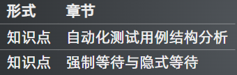

### capability 配置参数解析

#### Capability 简介

* 功能：配置 Appium 会话，告诉 Appium 服务器需要自动化的平台的应用程序
* 形式：键值对的集合，键对应设置的名称，值对应设置的值
* 主要分为三部分
  * 公共部分
  * ios 部分
  * android 部分

#### Session

* Appium 的客户端和服务端之间进行通信的前提
* 通过 Desired Capabilities 建立会话

#### 公共部分参数配置

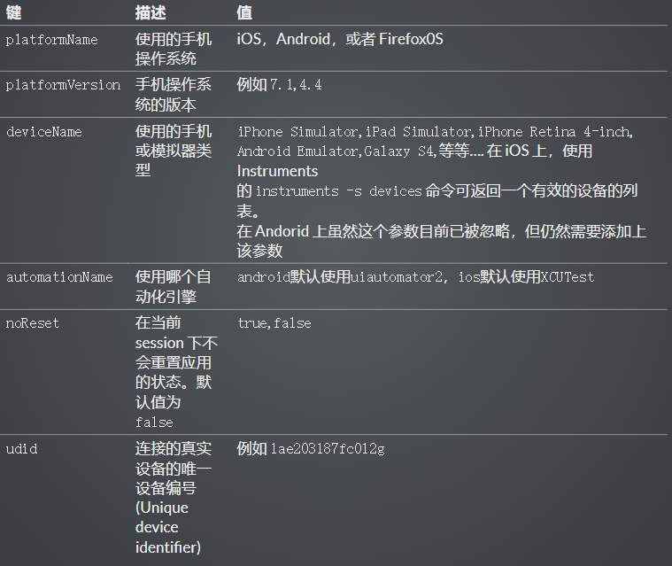

#### Android 部分特有参数配置

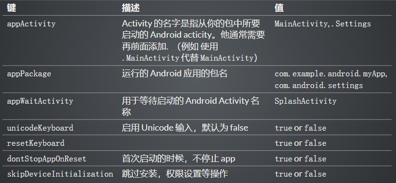

#### iOS 独有

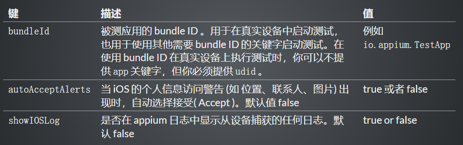

### app 自动化控制

#### 启动

* 启动应用
* 方式一：webdriver.remote("url",desirecapability)
* 方式二：launch_app() 将应用启动起来

```python
# 方式一：
self.driver = webdriver.Remote\
("http://127.0.0.1:4723/wd/hub", desire_cap)

# 方式二：
self.driver.launch_app()
```

#### 数据清理

* 清空输入框内容
  * clear()

```python
self.driver.find_element_by_accessibility_id('SomeAccessibilityID').clear()
关闭
退出app

quit()
self.driver.quit()

```

#### 关闭

* 退出app
  * quit()

```python
self.driver.quit()
```

### 常见控件定位方法

#### android 基础知识

* Android 是通过容器的布局属性来管理子控件的位置关系，布局关系就是把界面上的所有的空间，根据他们的间距的大小，摆放在正确的位置
* Android 七大布局
  * LinerLayout（线性布局）
  * RelativeLayout（相对布局）
  * FrameLayout（帧布局）
  * AboluteLayout（绝对布局）
  * TableLayout（表格布局）
  * GridLayout（网格布局）
  * ConstraintLayout（约束布局)
* 常用的控件
  * TextView（文本控件），EditText（可编辑文本控件）
  * Button（按钮），ImageButton（图片按钮），ToggleButton（开关按钮）
  * ImageView（图片控件）
  * CheckBox（复选框控件），RadioButton（单选框控件）
  * Android 四大组件
  *activity 与用户交互的可视化界面
  * service 实现程序后台运行的解决方案
  *content provider 内容提供者，提供程序所需要的数据
  *broadcast receiver 广播接收器，监听外部事件的到来（比如来电）
* 布局
  * 是可用于放置很多控件的容器按照一定的规律调整内部控件的位置由此构成界面。
* 嵌套布局
  * 布局内部放置布局，多层布局嵌套，可以完成复杂的界面结构

#### ios 基础知识

* 布局
  * iOS 不使用布局的概念，用变量之间的相对关系完成位置的计算
* 注意
  * 使用 Appium 测试 iOS 应用需要使用 MacOS 操作系统

#### 元素定位

* 概念：元素定位的含义就是定位控件
* 注意：同一脚本同时支持 android/iOS 两个系统的前提是元素属性（id，aid，xpath 等）一致

#### 控件基础知识

* dom：Document Object Model 文档对象模型
* dom 应用：用于表示界面的控件层级，界面的结构化描述
  * 常见的格式：html、xml
  * 核心元素：节点、属性
* xpath：xml 路径语言，用于 xml 中的节点定位

* Anrdroid 应用的层级结构与 html 不一样，是一个定制的 xml
* app source 类似于 dom ，表示 app 的层级，代表了界面里面所有的控件树的结构
* 每个控件都有它的属性（resourceid，xpath，aid），但是没有 css 属性

#### app dom 结构解析

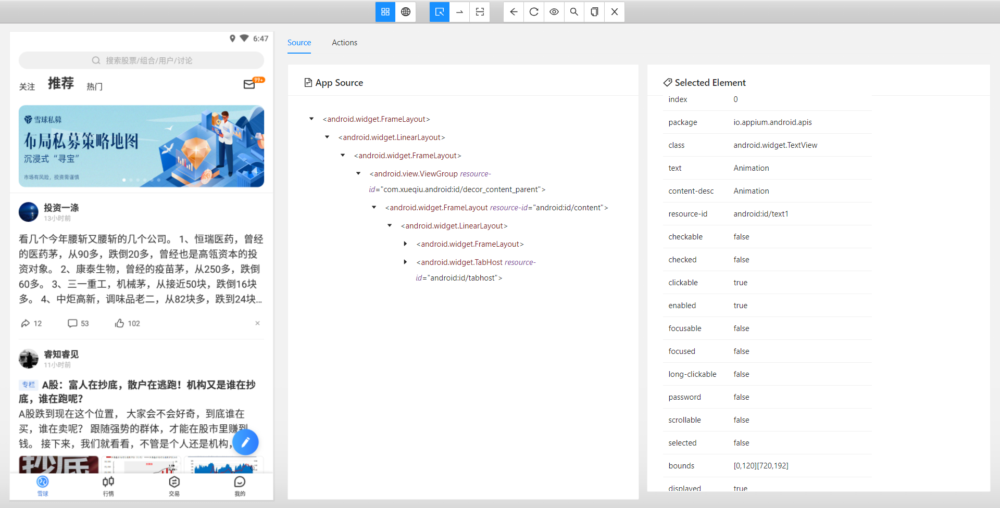

**app dom 示例**

* node
* attribute
  * clickable
  * content-desc
  * resource-id
  * text
  * bounds

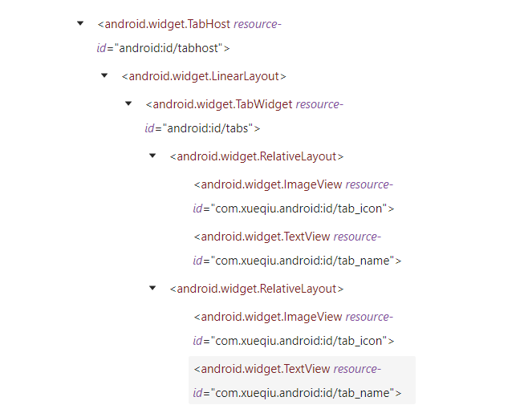

#### iOS 与 Android dom 结构的区别
* dom 属性和节点结构类似
* 名字和属性命名不同
  * android 的 resourceid 和 ios 的 name
  * android 的 content-desc 和 ios 的 accessibility-id

### 常见的控件定位方法

#### 定位方法

* 测试步骤三要素
  * 定位、交互、断言
* 定位方式：
  * id 定位
  * accessibilty_id 定位
  * xpath 定位
  * classname 定位（不推荐）

#### App 定位方式

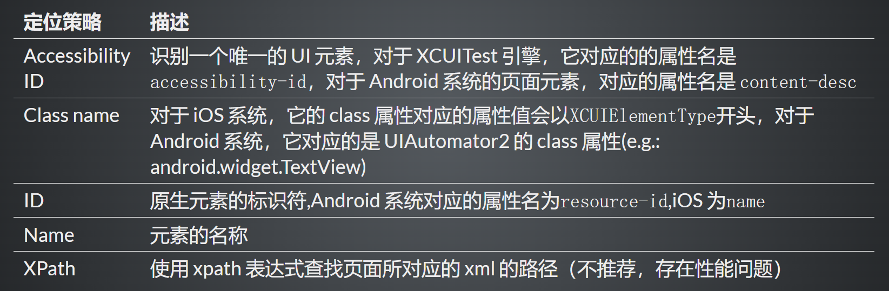

#### App 定位方式进阶

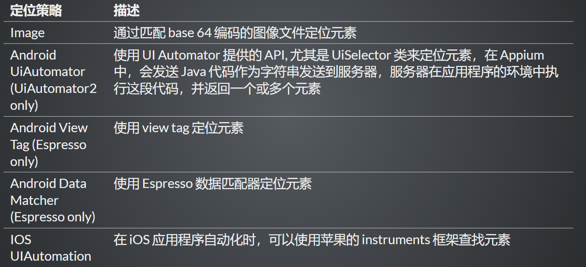

#### 选择定位器通用原则

* 与研发约定的属性优先
  * android 推荐 content-description
  * ios 推荐 label
* 身份属性 id
* 组合定位 xpath,css
* 其它定位

#### 元素定位的写法

* 返回单个元素 WebElement
* 返回元素列表 [WebElement, WebElement, WebElement…]

```python
# 返回单个元素 WebElement
driver.find_element(AppiumBy.xxx, "xxx属性值")
# 返回元素列表 [WebElement, WebElement, WebElement...]
driver.find_elements(AppiumBy.xxx, "xxx属性值")
```

```python
driver.find_element(AppiumBy.ID, "ID属性值")
driver.find_element(AppiumBy.XPATH, "xpath表达式")
driver.find_element(AppiumBy.CLASS_NAME, "CLASS属性值")
driver.find_element(AppiumBy.ACCESSIBILITY_ID, "ACCESSIBILITY_ID表达式")
driver.find_element(AppiumBy.ANDROID_UIAUTOMATOR, "android uiautomator 表达式")
driver.find_element(AppiumBy.IOS_UIAUTOMATION, "ios uiautomation 表达式")
driver.find_element(AppiumBy.ANDROID_VIEWTAG, "ESPRESSO viewtag 表达式")
driver.find_element(AppiumBy.ANDROID_DATA_MATCHER, "ESPRESSO data matcher 表达式")
driver.find_element(AppiumBy.IMAGE, "IMAGE图片")
```
```python
driver.find_elements(AppiumBy.ID, "ID属性值")
driver.find_elements(AppiumBy.XPATH, "xpath表达式")
driver.find_elements(AppiumBy.CLASS_NAME, "CLASS属性值")
driver.find_elements(AppiumBy.ACCESSIBILITY_ID, "ACCESSIBILITY_ID表达式")
driver.find_elements(AppiumBy.ANDROID_UIAUTOMATOR, "android uiautomator 表达式")
driver.find_elements(AppiumBy.IOS_UIAUTOMATION, "ios uiautomation 表达式")
driver.find_elements(AppiumBy.ANDROID_VIEWTAG, "ESPRESSO viewtag 表达式")
driver.find_elements(AppiumBy.ANDROID_DATA_MATCHER, "ESPRESSO data matcher 表达式")
driver.find_elements(AppiumBy.IMAGE, "IMAGE图片")
```

#### ID 定位

* 通过身份标识 id 查找元素
* 写法：find_element(AppiumBy.ID, "ID属性值")

#### ACCESSIBILITY_ID 定位

* 通过 accessibility id 查找元素
* 写法：find_element(AppiumBy.ACCESSIBILITY_ID, "ACCESSIBILITY_ID属性值")

#### XPath 定位

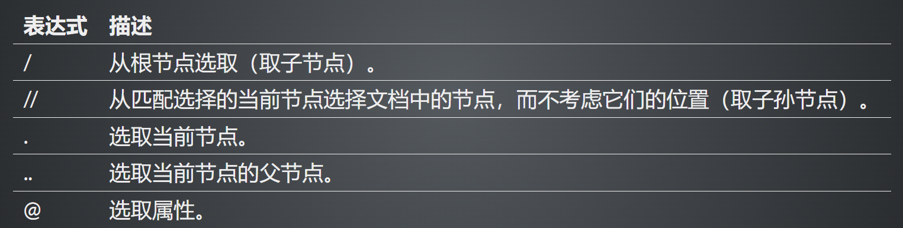

**XPath 单属性定位**
基本表达式：//*[@属性名='属性值']
**XPath 多属性定位**
表达式：//*[@属性名='属性值' and @属性名='属性值' ]

#### Android 原生定位

* 元素属性定位
* ID 定位
* 文本定位
* 文本匹配定位
* 父子关系定位
* 兄弟关系定位

**Android 原生定位 - 单属性定位**

* 格式 'new UiSelector().属性名("<属性值>")'
  * 比如：'new UiSelector().resourceId("android:id/text1")'
* 注意外面是单引号，里面是双引号，顺序不能变
* 可以简写为 属性名("<属性值>")'
  * 比如：·resourceId("android:id/text1")

```python
# ID 定位
def test_android_uiautomator_by_id(self):   
        print(self.driver.find_element(AppiumBy.ANDROID_UIAUTOMATOR,\
                'new UiSelector().resourceId("android:id/text1")'))
# TEXT 定位
def test_android_uiautomator_by_text(self):
        print(self.driver.find_element(AppiumBy.ANDROID_UIAUTOMATOR,\
                'new UiSelector().text("App")'))

# classname 定位
def test_android_uiautomator_by_className(self):   
        print(self.driver.find_element(AppiumBy.ANDROID_UIAUTOMATOR, \
                'new UiSelector().className("android.widget.TextView")'))
```

**Android 原生定位-组合定位**

* 多个属性同时确定元素的（多个属性任意组合 ，不限长度）

```python
driver.find_element_by_android_uiautomator('\
    new UiSelector().resourceId("com.xueqiu.android:id/tab_name").\
    text("我的")')
```

**Android 原生定位-模糊匹配**

* 文字包含
* 文字以 x 开头
* 文字正则匹配

```python
# 模糊匹配
def test_android_uiautomator_by_text_contains(self):
    print(self.driver.find_element(AppiumBy.ANDROID_UIAUTOMATOR, 'new UiSelector().textContains("ssi")').text)

def test_android_uiautomator_by_text_start_with(self):
    print(self.driver.find_element(AppiumBy.ANDROID_UIAUTOMATOR, 'new UiSelector().textStartsWith("Ani")').text)

def test_android_uiautomator_by_text_match(self):
    print(self.driver.find_element(AppiumBy.ANDROID_UIAUTOMATOR, 'new UiSelector().textMatches("^Pre.*")').text)
```

**Android 原生定位-层级定位**

* 兄弟元素定位 fromParent
* 父子结点定位 childSelector, 可以传入 resourceId() , description() 等方法

```python
# 查找目标元素Text，先找App ，fromParent() 方法可以查找兄弟结点
new UiSelector().text("App").fromParent(text("Text"))

# 根据父结点查找子结点/ 子孙结点
new UiSelector().className("android.widget.ListView").childSelector(text("Text"))
```

**滑动查找元素**

```python
new UiScrollable(new UiSelector().scrollable(true).instance(0)).scrollIntoView(new UiSelector().text("查找的元素文本").i
```

#### 总结

* Appium 提供多种元素定位方式，id，xpath, class, 也可以通过 Android Uiautomator 定位，或 iOS Predicate
* xpath 是比较灵活的定位方式（后面有章节详细介绍高级用法）
* 原生定位了解即可

### 常见的交互方法

#### 元素的常用方法

* 点击方法 element.click()
* 输入操作 element.send_keys('appium')
* 设置元素的值 element.set_value('appium')
* 清除操作 element.clear()
* 是否可见 element.is_displayed() 返回 True/False
* 是否可用 element.is_enabled() 返回 True/False
* 是否被选中 element.is_selected() 返回 True/False
* 获取属性值 get_attribute(name)

* get_attribute() 方法能获取的属性，元素的属性几乎都能获取到,属性名称和 uiautomatorviewer 里面的一致
* 源码地址： https://github.com/appium/appium-uiautomator2-server/blob/master/app/src/main/java/io/appium/uiautomator2/handler/GetElementAttribute.java
* get_attribute() 可以获取的属性
  * resource-id/resourceld 返回 resource-id（API=>18 支持)
  * text 返回 text
  * class 返回 class（API=>18 支持）
  * content-desc/contentDescription 返回 content-desc 属性
  * checkable,checked,clickable,enabled,focusable,focused,{long-clickable,longClickable), package, password,scrollable,selection-start,selection-end,selected,bounds,displayed,contentSize 返回 true or false

#### 元素常用属性

* 获取元素文本
  * 格式:element.text
* 获取元素坐标
  * 格式:element.location
  * 结果:{'y': 19,'x: 498}
* 获取元素尺寸(高和宽)
  * 格式:element.size
  * 结果:{'width':500,'height':22)

### 获取app启动参数

**mac获取命令为：**
`adb logcat ActivityManager:I | grep "cmp"`
**Windows为：**
`adb logcat ActivityManager:I | findstr "cmp"`

