## 用户端 Web自动化测试实战

**知识点梳理**
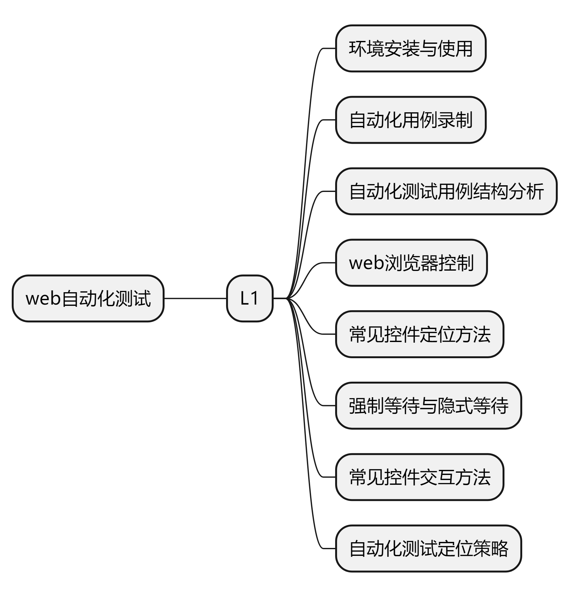
**手工测试与自动化测试场景对比**
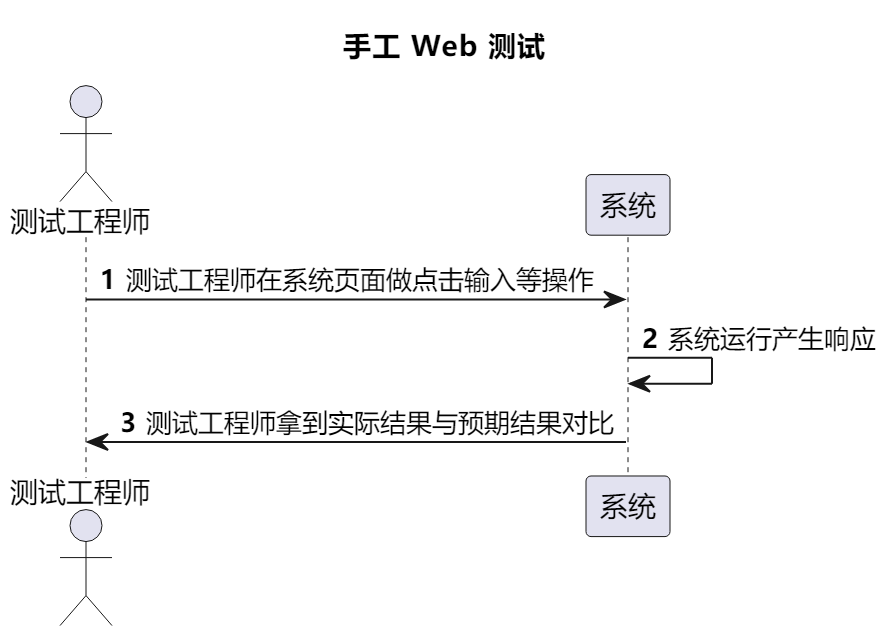
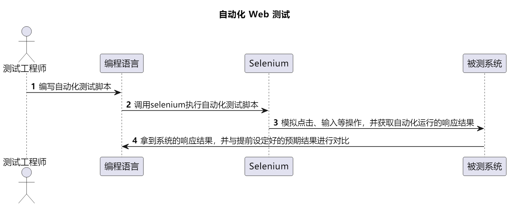

**什么时候可以做 Web 自动化测试**

* 业务流程不频繁改动
* UI 元素不频繁改动
* 需要频繁回归的场景
* 核心场景等

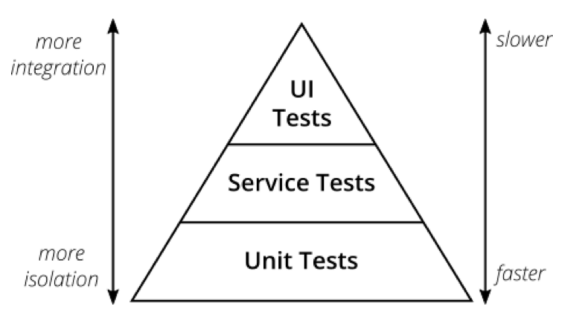

**Web 自动化测试相关技术**
* Selenium：支持多语言，行业内最火最主流
* Pytest：最好用最全面的单元测试框架
* Allure：测试报告

**Selenium的简介**
* 用于web浏览器测试的工具
* 支持的浏览器包括IE，Firefox，Safari，Chrome，Edge等
* 使用简单，可使用Java，Python等多种语言编写用例脚本
* 主要由三个工具构成：WebDriver、IDE、Grid

**Selenium架构图**
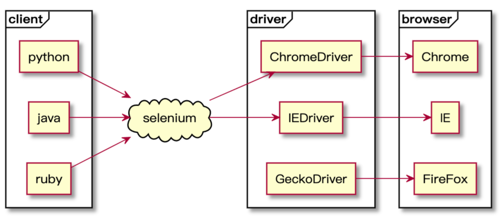

**SeleniumIDE用例录制**

**使用场景**
* 刚开始入门UI自动化测试
* 团队代码基础较差
* 技术成长之后学习价值不高

**常用功能**

1. 新建、保存、打开
2. 开始和停止录制
3. 运行8中的所有的实例
4. 运行单个实例
5. 调试模式
6. 调整案例的运行速度
7. 要录制的网址
8. 实例列表
9. 动作、目标、值
10. 对单条命令的解释
11. 运行日志

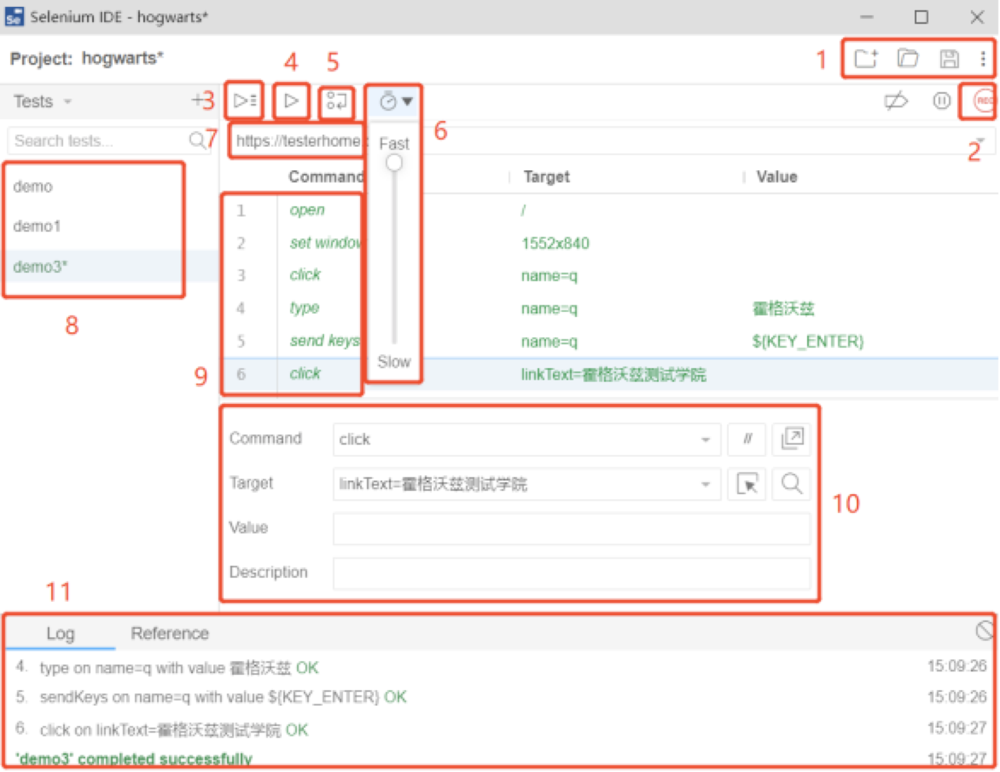
其他常用功能
* 用例管理
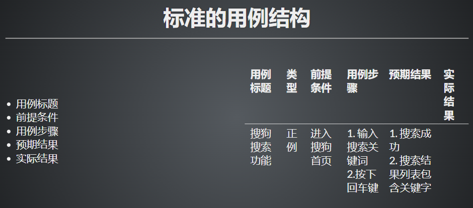
* 保存和回放

**脚本优化**
```python
import pytest
import time
import json
from selenium import webdriver
from selenium.webdriver.common.by import By
from selenium.webdriver.common.action_chains import ActionChains
from selenium.webdriver.support import expected_conditions
from selenium.webdriver.support.wait import WebDriverWait
from selenium.webdriver.common.keys import Keys
from selenium.webdriver.common.desired_capabilities import DesiredCapabilities

class TestDemo01():
  def setup_method(self, method):
    # 实例化chromedriver
    self.driver = webdriver.Chrome()
    # 添加全局隐式等待
    self.driver.implicitly_wait(5)
  
  def teardown_method(self, method):
    # 关闭driver
    self.driver.quit()
  
  def test_demo01(self):
    # 访问网站
    self.driver.get("https://www.baidu.com/")
    # 设置窗口
    self.driver.set_window_size(1330, 718)
    # 点击输入框
    self.driver.find_element(By.ID, "kw").click()
    # 输入框输入信息
    self.driver.find_element(By.ID, "kw").send_keys("霍格沃兹测试开发")
    # 点击搜索按钮
    self.driver.find_element(By.ID, "su").click()
    # 等待界面加载
    time.sleep(5)
    # 元素定位后获取文本信息
    res = self.driver.find_element(By.XPATH,"//*[@id='1']/h3/a").get_attribute("text")
    # 打印文本信息
    print(res)
    # 添加断言
    assert "霍格沃兹测试开发" in res
    # 查看界面展示
    time.sleep(5)
```

**实战二目标**
* 编写测试人网站的 Web 自动化测试用例。
  1. 掌握浏览器的控制方法
  2. 熟悉定位元素方法与交互操作
  3. 学会元素等待方式

**相关知识点**
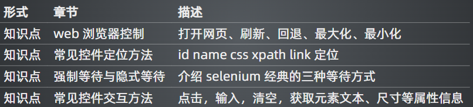

### web 浏览器控制
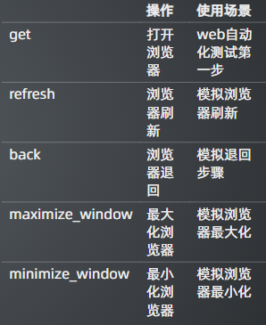
**get方法打开浏览器**
```python
from selenium import webdriver
import time

def window_start():
    # 实例化chromedriver
    driver = webdriver.Chrome()
    # 打开网站
    driver.get('http://www.ceshiren.com')
    # 等待一秒
    time.sleep(1)

if __name__ == '__main__':
    window_start()
```
**refresh方法刷新页面**
```python
from selenium import webdriver
import time

def window_refresh():
    # 实例化chromedriver
    driver = webdriver.Chrome()
    # 打开网站
    driver.get('http://www.ceshiren.com')
    # 等待一秒
    time.sleep(1)
    # 刷新网页
    driver.refresh()
    # 等待一秒
    time.sleep(1)

if __name__ == '__main__':
    window_refresh()
```
**用back方法回退到上一个界面**
```python
from selenium import webdriver
import time
from selenium.webdriver.common.by import By

def window_back():
    # 实例化chromedriver
    driver = webdriver.Chrome()
    # 打开网站
    driver.get('http://www.ceshiren.com')
    # 等待一秒
    time.sleep(1)
    driver.find_element(By.XPATH,"//*[@id='ember35']").click()
    # 等待一秒
    time.sleep(1)
    # 返回上一个界面
    driver.back()
    # 等待一秒
    time.sleep(1)

if __name__ == '__main__':
    window_back()
```
**maximize_window方法使窗口最大化**
```python
def max_window():
    # 实例化chromedriver
    driver = webdriver.Chrome()
    # 打开网站
    driver.get('http://www.ceshiren.com')
    # 等待一秒
    time.sleep(1)
    # 屏幕最大化
    driver.maximize_window()
    # 等待一秒
    time.sleep(1)

if __name__ == '__main__':
    max_window()
```
**minimize_window方法使窗口最小化**
```python
from selenium import webdriver
import time

def min_window():
    # 实例化chromedriver
    driver = webdriver.Chrome()
    # 打开网站
    driver.get('http://www.ceshiren.com')
    # 等待一秒
    time.sleep(1)
    # 屏幕最小化
    driver.minimize_window()
    # 等待一秒
    time.sleep(1)

if __name__ == '__main__':
    min_window()
```
### 常见控件定位方法
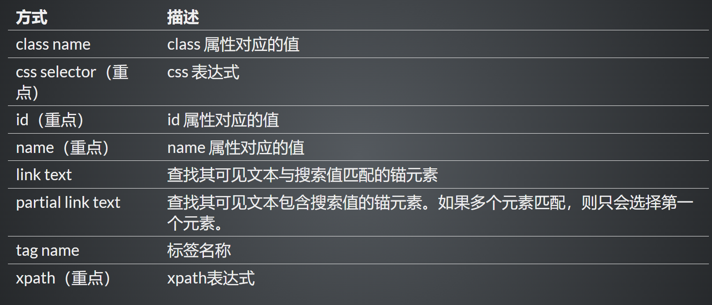
**HTML铺垫**
* 标签：`<a>`
* 属性：href
* 类属性: class
```angular2html
<!DOCTYPE html>
<html>
<head>
<meta charset="utf-8">
<title>测试人论坛</title>
</head>
<body>
<a href="https://ceshiren.com/" class="link">链接</a>
</body>
</html>
```
格式： 
```angular2html
driver.find_element_by_定位方式(定位元素)
driver.find_element(By.定位方式, 定位元素) 
```
示例，两种方式作用一模一样
官方建议使用下面的方式
```angular2html
driver.find_element_by_id("su")
driver.find_element(By.ID, "su") 
```
**通过 id 定位**

`driver.find_element(By.ID, "ID属性对应的值")`
```python
from selenium import webdriver
import time
from selenium.webdriver.common.by import By

def id_position_method():

    # 实例化chromedriver
    driver = webdriver.Chrome()
    # 打开网站
    driver.get('http://www.ceshiren.com')
    # 等待一秒
    time.sleep(1)
    # 点击“精华帖”
    driver.find_element(By.ID,"ember35").click()
    # 等待两秒
    time.sleep(2)

if __name__ == '__main__':
    id_position_method()
```
**name 定位**

`driver.find_element(By.NAME, "Name属性对应的值")`
```python
from selenium import webdriver
import time
from selenium.webdriver.common.by import By

def name_position_method():

    # 实例化chromedriver
    driver = webdriver.Chrome()
    # 打开网站
    driver.get('http://www.baidu.com')
    # 等待一秒
    time.sleep(1)
    # 点击更多
    driver.find_element(By.NAME,"tj_briicon").click()
    # 等待两秒
    time.sleep(2)

if __name__ == '__main__':
    name_position_method()
```
**css selector 定位**
` driver.find_element(By.CSS_SELECTOR, "css表达式")`
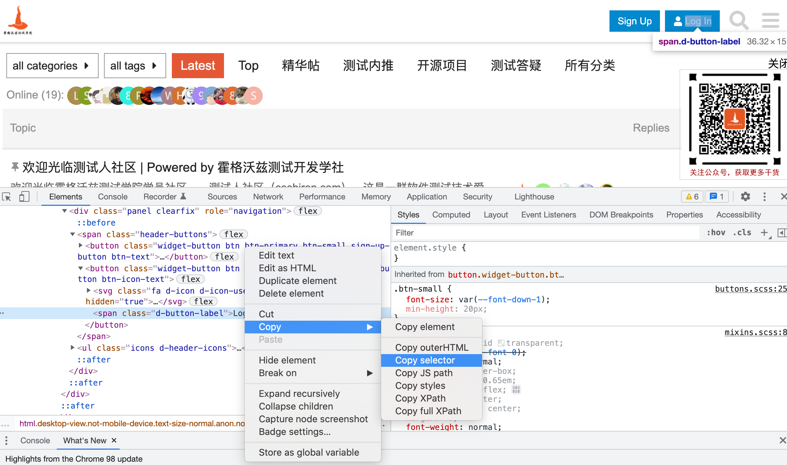
**xpath 定位**
`driver.find_element(By.XPATH, "xpath表达式")`
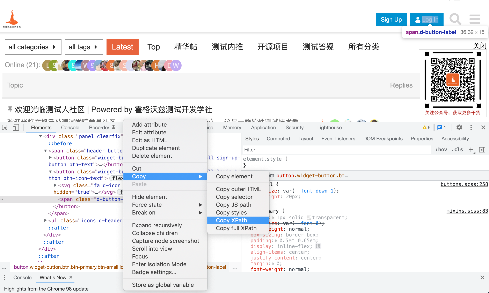
**link 定位**
`driver.find_element(By.LINK_TEXT,"文本信息")`

### 强制等待与隐式等待
**为什么要添加等待**

避免页面未渲染完成后操作，导致的报错
```python
from selenium import webdriver
from selenium.webdriver.common.by import By

def wait_sleep():
    """
    如果直接执行，不添加任何等待，可能会报错
    """
    driver = webdriver.Chrome()
    driver.get("https://vip.ceshiren.com/")
    # 不加等待，可能会因为网速等原因产生报错
    driver.find_element(By.XPATH, "//*[text()='个人中心']")

if __name__ == '__main__':
    wait_sleep()
```
**直接等待**
* 解决方案：在报错的元素操作之前添加等待
* 原理：强制等待，线程休眠一定时间
* 演练环境：https://vip.ceshiren.com/
* time.sleep(3)
```python
from selenium import webdriver
from selenium.webdriver.common.by import By

def wait_sleep():
    """
    如果直接执行，不添加任何等待，可能会报错
    """
    driver = webdriver.Chrome()
    driver.get("https://vip.ceshiren.com/")
    # 添加等待，让页面渲染完成
    time.sleep(3)
    driver.find_element(By.XPATH, "//*[text()='个人中心']")

if __name__ == '__main__':
    wait_sleep()
```
**隐式等待**
* 问题：难以确定元素加载的具体等待时间。
* 解决方案：针对于寻找元素的这个动作，使用隐式等待添加配置。
* 演练环境：https://vip.ceshiren.com/
* 原理：设置一个等待时间，轮询查找（默认0.5秒）元素是否出现，如果没出现就抛出异常

```python
#设置一个等待时间，轮询查找（默认0.5秒）元素是否出现，如果没出现就抛出异常
driver.implicitly_wait(3)
```
隐式等待无法解决的问题
* 元素可以找到，使用点击等操作，出现报错
* 原因：
  * 页面元素加载是异步加载过程，通常html会先加载完成，js、css其后
  * 元素存在与否是由HTML决定，元素的交互是由css或者js决定
  * 隐式等待只关注元素能不能找到，不关注元素能否点击或者进行其他的交互
* 解决方案：使用显式等待

**显式等待基本使用(初级)**
* 示例： WebDriverWait(driver实例, 最长等待时间, 轮询时间).until(结束条件)
* 原理：在最长等待时间内，轮询，是否满足结束条件
* 演练环境： https://vip.ceshiren.com/#/ui_study
* 注意：在初级时期，先关注使用
```python
def wait_until():
    driver = webdriver.Chrome()
    driver.get("https://vip.ceshiren.com/#/ui_study")
    WebDriverWait(driver, 10).until(
        expected_conditions.element_to_be_clickable(
            (By.CSS_SELECTOR, '#success_btn')))
    driver.find_element(By.CSS_SELECTOR, "#success_btn").click()
```
**总结**
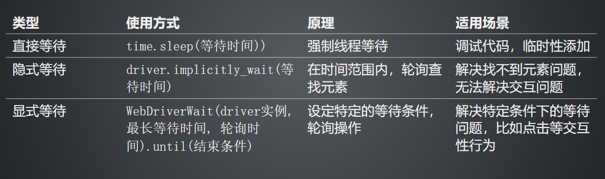

### 常见控件交互方法
**点击，输入，清空**
* 点击百度搜索框
* 输入”霍格沃兹测试开发”
* 清空搜索框中信息
* 演练地址： https://www.baidu.com/
```python
# 点击百度搜索框
driver.find_element(By.ID,"kw").click()
# 输入"霍格沃兹测试开发"
driver.find_element(By.ID,"kw").send_keys("霍格沃兹测试开发")
# 清空搜索框中信息
driver.find_element(By.ID,"kw").clear()
```
**获取元素属性信息**
* 原因：
  * 定位到元素后，获取元素的文本信息，属性信息等
* 目的：
  * 根据这些信息进行断言或者调试
* 演练地址： https://vip.ceshiren.com/#/ui_study

**获取元素属性信息的方法**
* 获取元素文本
* 获取元素的属性（html的属性值）
```python
# 获取元素文本
driver.find_element(By.ID, "id").text
# 获取这个元素的name属性的值
driver.find_element(By.ID, "id").get_attribute("name")
```
**课堂练习**
* 通过对应 API 实现对页面元素的操控。
  * 点击
  * 输入
  * 获取元素文本

实战思路
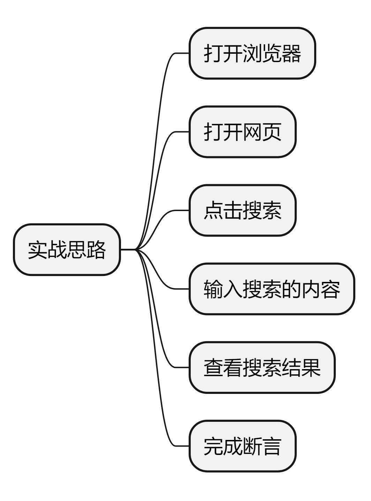
```python
from selenium import webdriver
from selenium.webdriver.common.by import By


class TestSearch:

    def setup_class(self):
        # 打开浏览器
        self.driver = webdriver.Chrome()
        self.driver.implicitly_wait(5)

    def teardown_class(self):
        self.driver.quit()

    def test_search(self):
        # 打开网页
        self.driver.get("https://ceshiren.com/")
        # 点击搜索
        self.driver.find_element(By.ID, "search-button").click()
        # 输入搜索的内容
        self.driver.find_element(By.ID, "search-term").send_keys("霍格沃兹测试开发")
        self.driver.find_element(By.CLASS_NAME, "keyword").click()
        # 查看搜索结果
        elements = self.driver.find_elements(By.CLASS_NAME, "first-line")
        # 完成断言
        names = [ele.text for ele in elements]
        assert '关于霍格沃兹测试开发学社' in names
```
## 用户端 Web自动化测试实战2
**知识点梳理**

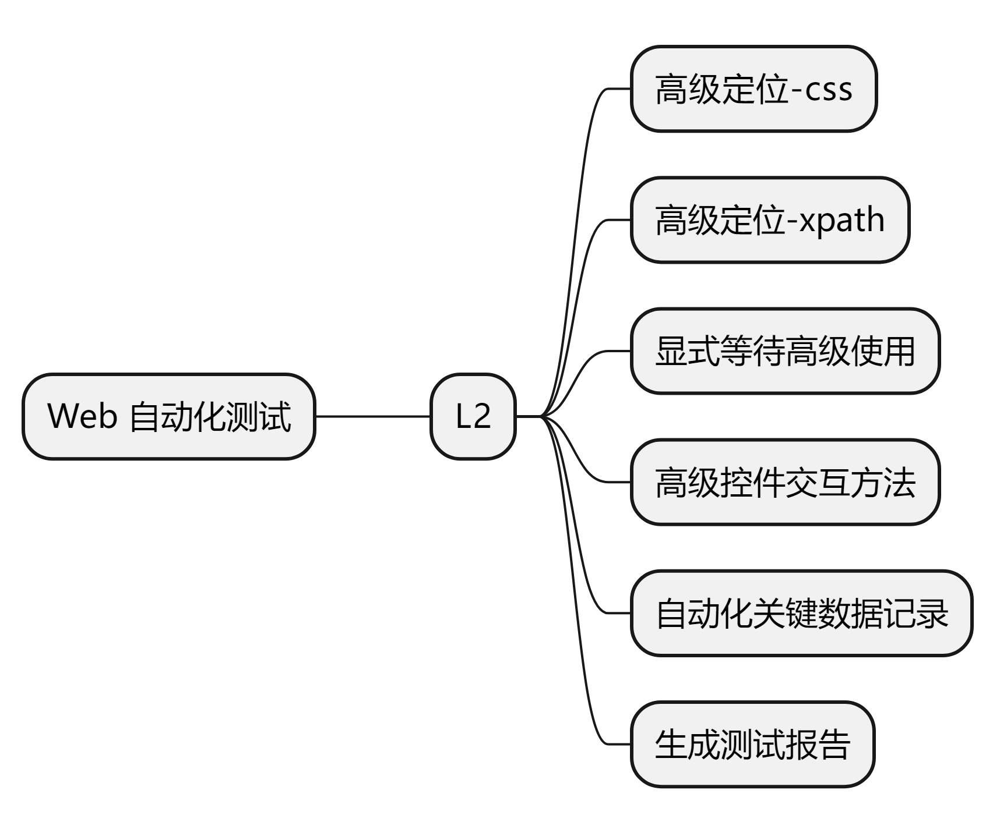

实战一目标
* 掌握元素高级定位技巧
* 熟悉高级元素等待的用法
* 了解多窗口处理

**相关知识点**

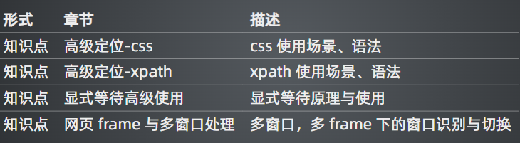
### 高级定位-css
* css 选择器概念
* css 相对定位使用场景
* css 语法与实战

**概念**

* css 选择器有自己的语法规则和表达式
* css 定位通常分为绝对定位和相对定位
* 和Xpath一起常用于UI自动化测试中的元素定位

**场景**

* 支持web产品
* 支持app端的webview

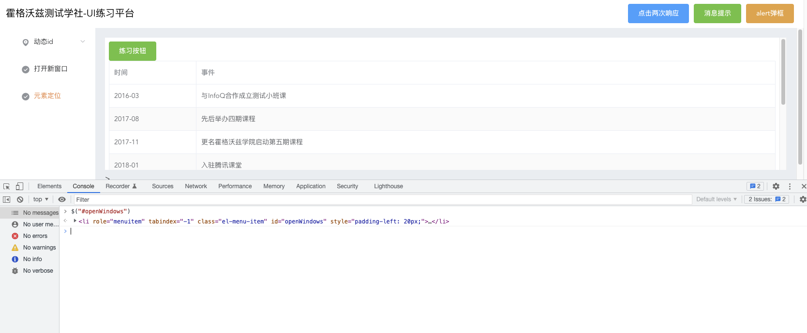
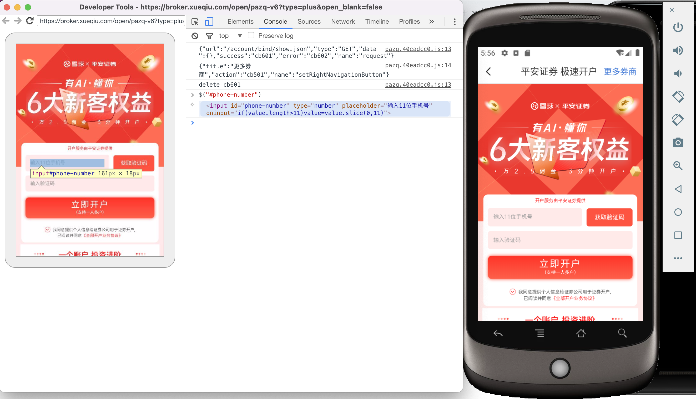
**优点**
* 可维护性更强
* 语法更加简洁
* 解决各种复杂的定位场景

```python
# 绝对定位
$("#ember63 > td.main-link.clearfix.topic-list-data > span > span > a")
# 相对定位
$("#ember63 [title='新话题']")
```
**调试方法**
* 进入浏览器的console
* 输入:
  * $("css表达式")
  * 或者$$("css表达式")

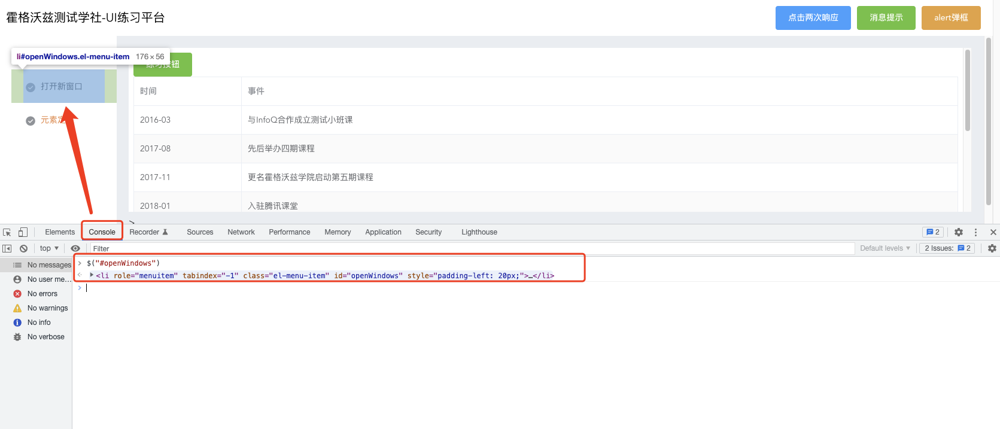

**css基础语法**

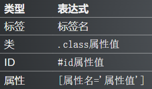
```python
//在console中的写法
// https://www.baidu.com/
//标签名
$('input')
//.类属性值
$('.s_ipt')
//#id属性值
$('#kw')
//[属性名='属性值']
$('[name="wd"]')
```
**css关系定位**

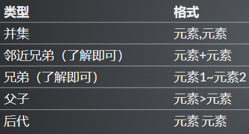

```python
//在console中的写法
//元素,元素
$('.bg,.s_ipt_wr,.new-pmd,.quickdelete-wrap')
//元素>元素
$('#s_kw_wrap>input')
//元素 元素
$('#form input')
//元素+元素，了解即可
$('.soutu-btn+input')
//元素1~元素2，了解即可
$('.soutu-btn~i')
```
**css 顺序关系**

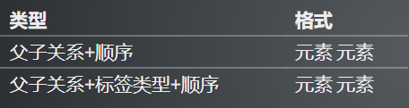

```python
//:nth-child(n)
$('#form>input:nth-child(2)')
//:nth-of-type(n)
$('#form>input:nth-of-type(1)')
```

**课堂练习**
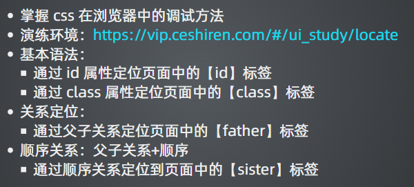
```python
#  通过 id 属性定位页面中的【id】标签
$("#located_id")
#  通过 class 属性定位页面中的【class】标签
$(".el-button.mr-5.locate_class_name.el-button--primary")
#  通过父子关系定位页面中的【father】标签
$(".grandfather>.father")
#  通过顺序关系定位到页面中的【sister】标签
$(".father>div:nth-child(4)")
```
### 高级定位-xpath

**概念**
* XPath 是一门在 XML 文档中查找信息的语言
* XPath 使用路径表达式在 XML 文档中进行导航
* XPath 的应用非常广泛
* XPath 可以应用在UI自动化测试

**场景**

* web自动化测试
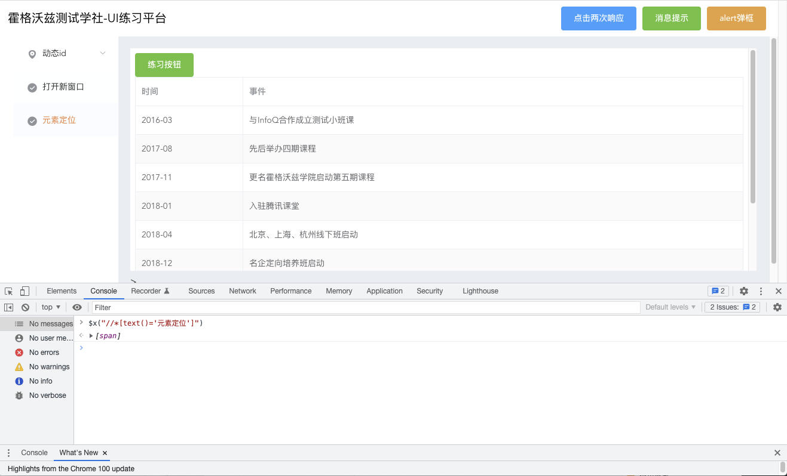
* app自动化测试
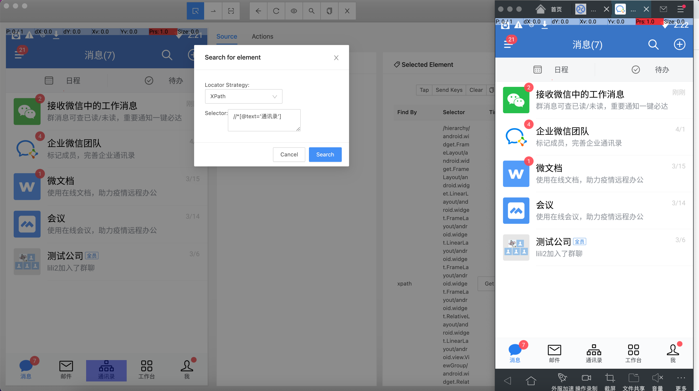

**优点**
* 可维护性更强
* 语法更加简洁
* 相比于css可以支持更多的方式
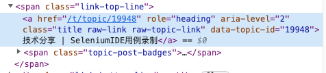

```python
# 复制的绝对定位
$x('//*[@id="ember75"]/td[1]/span/a')
# 编写的相对行为
$x("//*[text()='技术分享 | SeleniumIDE用例录制']")
```

**调试方法**
* 浏览器-console
  * $x("xpath表达式")
* 浏览器-elements
  * ctrl+f 输入xpath或者css
  
**基础语法（包含关系）**
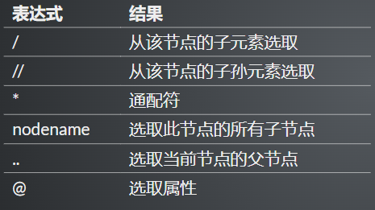
```python
# 整个页面
$x("/")
# 页面中的所有的子元素
$x("/*")
# 整个页面中的所有元素
$x("//*")
# 查找页面上面所有的div标签节点
$x("//div")
# 查找id属性为site-logo的节点
$x('//*[@id="site-logo"]')
# 查找节点的父节点
$x('//*[@id="site-logo"]/..')
```
**顺序关系（索引）**

* xpath通过索引直接获取对应元素
```python
# 获取此节点下的所有的li元素
$x("//*[@id='ember21']//li")
# 获取此节点下【所有的节点的】第一个li元素
$x("//*[@id='ember21']//li[1]")
```

**xpath 高级用法**
```python
[last()]: 选取最后一个
[@属性名='属性值' and @属性名='属性值']: 与关系
[@属性名='属性值' or @属性名='属性值']: 或关系
[text()='文本信息']: 根据文本信息定位
[contains(text(),'文本信息')]: 根据文本信息包含定位
注意：所有的表达式需要和[]结合
```

```python
# 选取最后一个input标签
//input[last()]
# 选取属性name的值为passward并且属性pwd的值为123456的input标签
//input[@name='passward' and @pwd='123456']
# 选取属性name的值为passward或属性pwd的值为123456的input标签
//input[@name='passward' or @pwd='123456']
# 选取所有文本信息为'霍格沃兹测试开发'的元素
//*[text()='霍格沃兹测试开发']
# 选取所有文本信息包'霍格沃兹'的元素
//*[contains(text(),'霍格沃兹')]
```
**课堂练习**

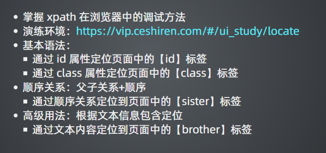

```python
# 通过 id 属性定位页面中的【id】标签
$x("//*[@id='located_id']")
# 通过 class 属性定位页面中的【class】标签
$x("//*[@class='el-button mr-5 locate_class_name el-button--primary']")
# 通过顺序关系定位到页面中的【sister】标签
$x("//*[@class='pos father']/div[2]")
# 通过文本内容定位到页面中的【brother】标签
$x("//*[text()='brother']")
```

### 显式等待高级使用

#### 原理
* 在代码中定义等待一定条件发生后再进一步执行代码
* 在最长等待时间内循环执行结束条件的函数
* WebDriverWait(driver 实例, 最长等待时间, 轮询时间).until(结束条件函数)

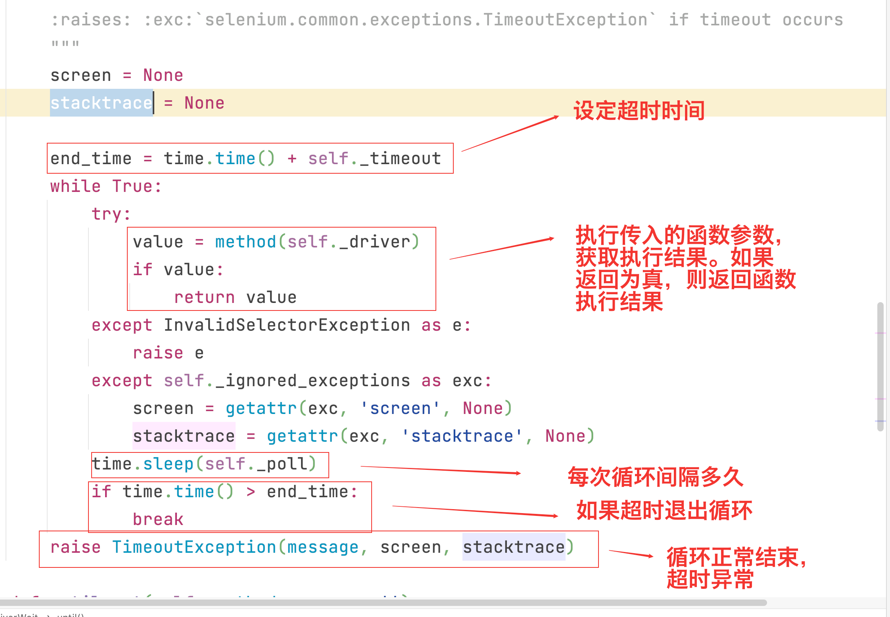

```python
from selenium import webdriver
from selenium.webdriver.common.by import By
from selenium.webdriver.support import expected_conditions
from selenium.webdriver.support.wait import WebDriverWait


def wait_until():
    driver = webdriver.Chrome()
    driver.get("https://vip.ceshiren.com/#/ui_study")
    WebDriverWait(driver, 10).until(
        expected_conditions.element_to_be_clickable(
            (By.CSS_SELECTOR, '#success_btn')))
    driver.find_element(By.CSS_SELECTOR, "#success_btn").click()
```
#### 常见 expected_conditions

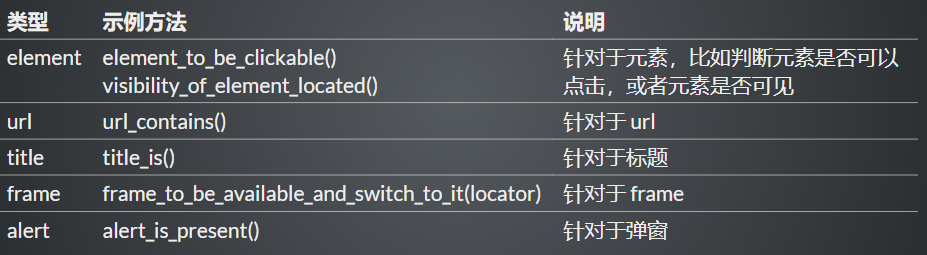

#### 显式等待-封装等待条件

* 官方的 excepted_conditions 不可能覆盖所有场景
* 定制封装条件会更加灵活、可控

```python
import time
from selenium import webdriver
from selenium.webdriver.common.by import By
from selenium.webdriver.remote.webdriver import WebDriver
from selenium.webdriver.support.wait import WebDriverWait


class TestWebdriverWait:

    driver = webdriver.Chrome()

    driver.maximize_window()
    driver.implicitly_wait(5)
    driver.get("https://vip.ceshiren.com/#/ui_study")
    def teardown(self):
        self.driver.quit()
    def test_webdriver_wait(self):
        # 解决的问题：有的按钮点击一次没有反应，可能要点击多次，比如企业微信的添加成员
        # 解决的方案：一直点击按钮，直到下个页面出现，封装成显式等待的一个条件
        def muliti_click(button_element,until_ele):
            # 函数封装
            def inner(driver):
                # 封装点击方法
                driver.find_element(By.XPATH,button_element).click()
                return driver.find_element(By.XPATH,until_ele)
            return inner
        time.sleep(5)
        # 在限制时间内会一直点击按钮，直到展示弹框
        WebDriverWait(self.driver,10).until(muliti_click("//*[text()='点击两次响应']","//*[text()='该弹框点击两次后才会弹出']"))
        time.sleep(5)
```

### 网页 frame 与多窗口处理

#### 场景

* 点击某些链接，会重新打开⼀个窗口

#### 多窗口的操作方法

* driver.current_window_handle:获取当前句柄
* driver.window_handles:获取所有句柄
* driver.switch_to.window():跳转到其他窗口

**多窗口切换案例**
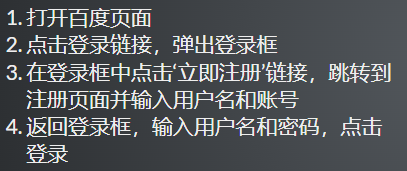
```python
import time

from selenium import webdriver
from selenium.webdriver.common.by import By


def test_window_handle():

    # 打开浏览器并访问百度页面
    driver = webdriver.Chrome()
    driver.maximize_window()
    driver.implicitly_wait(5)
    driver.get("https://www.baidu.com/")

    # 获取百度页面窗口句柄
    baidu_handle = driver.current_window_handle

    # 点击登录链接并切换窗口
    driver.find_element(By.LINK_TEXT, "登录").click()
    for handle in driver.window_handles:
        if handle != baidu_handle:
            driver.switch_to.window(handle)

    # 在登录框中点击‘立即注册’链接，跳转到注册页面并输入用户名和账号
    driver.find_element(By.LINK_TEXT, "立即注册").click()
    for handle in driver.window_handles:
        if handle != baidu_handle and handle != driver.current_window_handle:
            driver.switch_to.window(handle)
            driver.find_element(By.ID, "TANGRAM__PSP_4__userName").send_keys("username")
            driver.find_element(By.ID, "TANGRAM__PSP_4__phone").send_keys("1234567890")
            driver.close()
            driver.switch_to.window(driver.window_handles[-1])

    # 返回百度页面，输入用户名和密码，点击登录
    driver.switch_to.window(baidu_handle)
    time.sleep(3)
```

#### frame 基本概念

* frameset
* frame
* iframe

#### frame 常用操作方法

* driver.switch_to.frame(frame 元素对象)

**frame 切换案例**
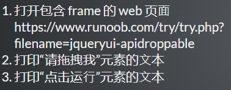
```python
from selenium import webdriver
from selenium.webdriver.common.by import By


def test_frame_deal_1():
    driver = webdriver.Chrome()
    driver.implicitly_wait(5)
    # 打开网页
    driver.get("https://www.runoob.com/try/try.php?filename=jqueryui-api-droppable")

    # 定位iframe元素
    frame = driver.find_element(By.ID, 'iframeResult')
    # 切换到指定frame
    driver.switch_to.frame(frame)
    print(driver.find_element(By.ID, "droppable").text)

    # 切换frame
    driver.switch_to.parent_frame()
    print(driver.find_element(By.ID, "submitBTN").text)
```
### 实战二目标
* 学会自动化关键数据记录
  1. 获取页面源码
  2. 记录操作日志
  3. 保存屏幕截图

#### 什么是关键数据

* 代码的执行日志
* 代码执行的截图
* page source（页面源代码）

**记录关键数据的作用**

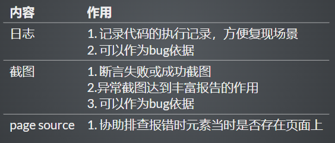

#### 行为日志记录
* 日志配置
* 脚本日志级别
  * debug记录步骤信息
  * info记录关键信息，比如断言等
```python
# 日志配置
import logging
# 创建logger实例
logger = logging.getLogger('simple_example')
# 设置日志级别
logger.setLevel(logging.DEBUG)
# 流处理器
ch = logging.StreamHandler()
ch.setLevel(logging.DEBUG)
# 日志打印格式
formatter = logging.Formatter\
('%(asctime)s - %(name)s - %(levelname)s - %(message)s')
# 添加格式配置
ch.setFormatter(formatter)
# 添加日志配置
logger.addHandler(ch)
```
```python
# 日志与脚本结合
class TestDataRecord:
    def setup_class(self):
        self.driver = webdriver.Chrome()
        self.driver.implicitly_wait(3)
    
    def teardown_class(self):
        self.driver.quit()

    def test_log_data_record(self):
        # 实例化self.driver
        search_content = "霍格沃兹测试开发"
        # 打开百度首页
        self.driver.get("https://www.sogou.com/")
        logger.debug("打开搜狗首页")
        # 输入霍格沃兹测试学院
        self.driver.find_element(By.CSS_SELECTOR, "#query").\
        send_keys(search_content)
        logger.debug(f"搜索的内容为{search_content}")
        # 点击搜索
        self.driver.find_element(By.CSS_SELECTOR, "#stb").click()
        # 搜索结果
        search_res = self.driver.find_element(By.CSS_SELECTOR, "em")
        logger.info(f"搜索结果为{search_res.text}")
        assert search_res.text == search_content
```

#### 步骤截图记录

* save_screenshot(截图路径+名称)
* 记录关键页面
  * 断言页面
  * 重要的业务场景页面
  * 容易出错的页面

```python
# 调用save方法截图并保存保存在当前路径下的images文件夹下
driver.save_screenshot('./images/search1.png')
```

#### page_source记录

* 使用page_source属性获取页面源码
* 在调试过程中，如果有找不到元素的错误可以保存当时的page_source调试代码

```python
# 在报错行前面添加保存page_source的操作
with open("record.html", "w", encoding="u8") as f:
    f.write(self.driver.page_source)
```

### 测试人论坛实战练习
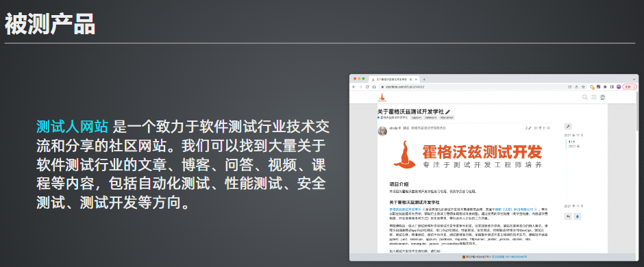
#### 需求说明

* 优化测试人论坛的 Web 自动化测试
  * 使用高级定位方式和显示等待
  * 记录关键日志和截图
  * 生成测试报告

#### 实战思路

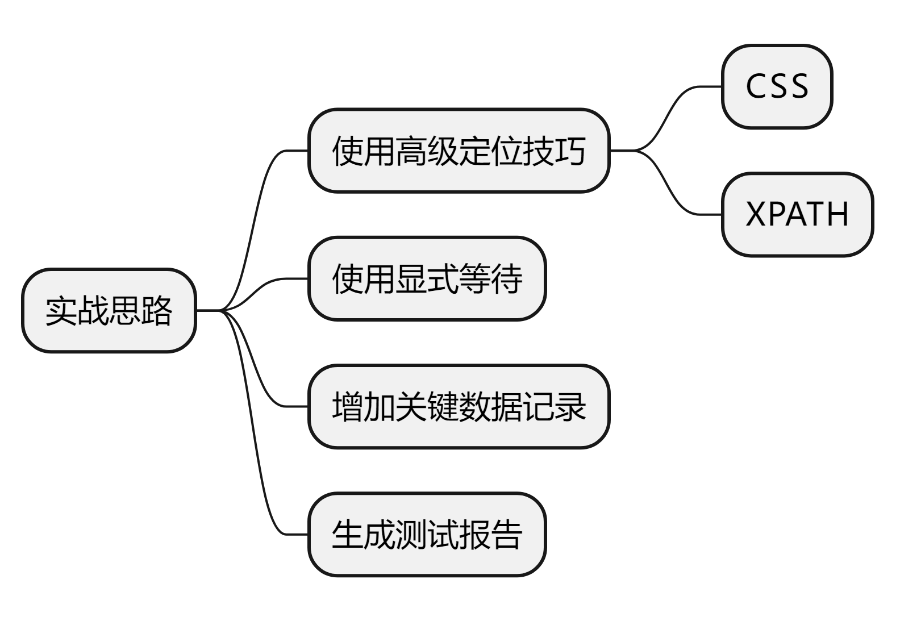

#### 题目解析

```python
import allure
from selenium import webdriver
from selenium.webdriver.common.by import By
from selenium.webdriver.support import expected_conditions
from selenium.webdriver.support.wait import WebDriverWait

from utils.log_util import logger


class TestSearch:

    def setup_class(self):
        logger.debug('打开浏览器')
        self.driver = webdriver.Chrome()
        self.driver.implicitly_wait(5)

    def teardown_class(self):
        self.driver.quit()

    def test_search(self):
        logger.debug('打开网页')
        self.driver.get("https://ceshiren.com/")
        logger.debug('点击搜索')
        self.driver.find_element(By.ID, "search-button").click()
        logger.debug('输入搜索的内容')
        self.driver.find_element(By.ID, "search-term").send_keys("霍格沃兹测试开发")
        self.driver.find_element(By.CLASS_NAME, "keyword").click()
        logger.debug('点击搜索结果条目')

        # 显示等待
        WebDriverWait(self.driver, 10).until(
            expected_conditions.element_to_be_clickable((By.XPATH, '//span[contains(text(), "关于")]'))
        )
        self.driver.find_element(By.XPATH, '//span[contains(text(), "关于")]').click()

        logger.debug('完成断言')
        title = self.driver.find_element(By.CSS_SELECTOR, '.fancy-title').text
        logger.info(f"帖子标题为：{title}")

        # 保存页面源码
        page_source_path = f"./page_source.html"
        with open(page_source_path, "w", encoding="u8") as f:
            f.write(self.driver.page_source)
        allure.attach.file(page_source_path, name="page_source", attachment_type=allure.attachment_type.TEXT)

        # 屏幕截图
        image_path = f"./images/image.png"
        self.driver.save_screenshot(image_path)
        allure.attach.file(image_path, name="image", attachment_type=allure.attachment_type.PNG)

        assert title == '关于霍格沃兹测试开发学社'
```