## 接口测试

### 接口概念

* 接口：不同的系统之间相互连接的部分，是一个传递数据的通道。
  * 输入 —> 处理 —> 输出。
  * 分类：内部接口、外部接口。
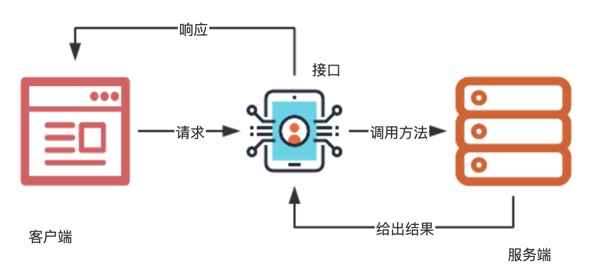

#### 接口测试概念

接口测试：检查数据的交换、传递和控制管理过程。
针对接口做的功能、安全、性能等的测试
#### 接口测试价值

* 传统的测试方法成本急剧上升
* 测试效率下降

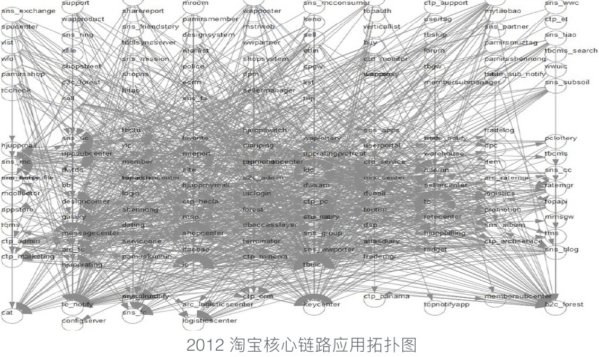

#### 测试策略

* 金字塔模型
  * 重单元测试，API测试次之，轻GUI测试。
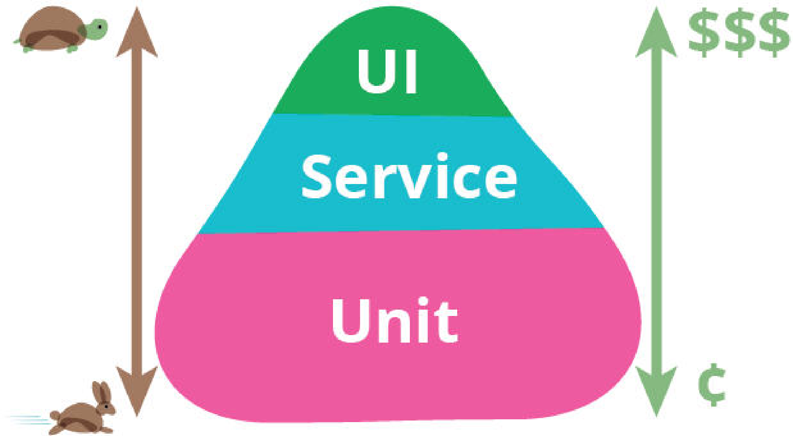

  * 单元测试：白盒，研发自测。
  * API测试：灰盒，利用测试执行的代码覆盖率来指导测试用例的设计。
  * UI 测试：端到端，稳定性问题。
  * 优点：实际模拟真实用户的行为。
  * 缺点：执行的代价比较大。
* 菱形模型
  * 重量级 API 测试，轻量级 GUI 测试，轻量级单元测试。
  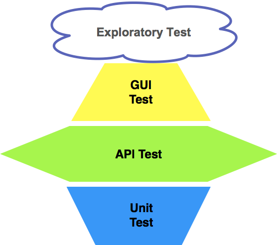

  * UI 测试：手工为主，自动化为辅。
    * UI自动化：相对稳定且核心业务的基本功能。
  * API测试：
    * 后向兼容性：保证原本的 API 调用方式维持不变。
  * 单元测试：相对稳定和最核心的模块和服务上。

#### 关键点

* API 测试为重点。
* GUI 测试最核心直接影响主营业务流程的 E2E 场景。
* 单元测试对那些相对稳定并且核心的服务和模块开展全面的单元测试。

#### URL 结构

```angular2html
https://www.baidu.com/s?wd=霍格沃兹&rsv_spt=1
&rsv_spt=1

协议：https
域名：www.baidu.com
端口：域名后面，非必须
81.70.96.121:10240
路径：/s
请求参数：wd=霍格沃兹&rsv_spt=1
```
总结:
* 锚:从#开始到最后
  * 指向文档中某个锚点
* 查询参数:从?开始到#结尾
  * 可以有多个
  * 多个参数用&拼接
  * 传递额外信息的一部分
* 路径参数:
  * 请求路径后的{id}
  * /topic/{id}

#### HTTP 请求报文

```angular2html
> GET /uploads/user/avatar/31438/8216a3.jpg HTTP/1.1
> Host: ceshiren.com
> Accept-Encoding: deflate, gzip
> Connection: keep-alive
> Pragma: no-cache
> Cache-Control: no-cache
> User-Agent: Mozilla/5.0 
(Macintosh; Intel Mac OS X 10_15_0)
 AppleWebKit/537.36 
 (KHTML, like Gecko) 
 Chrome/80.0.3987.116 Safari/537.36
> Accept: image/webp,image/apng,image/*,*/*;q=0.8
> Referer: https://ceshiren.com/
> Accept-Language: en,zh-CN;q=0.9,zh;q=0.8
> Cookie: user_id=xx;

_homeland_session=xx;
>
```

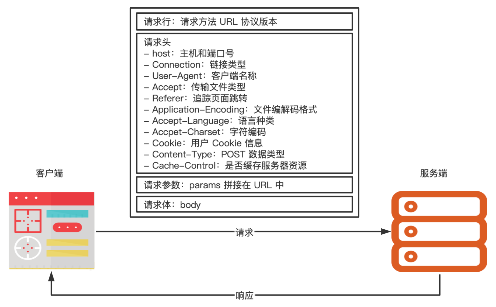

#### HTTP 响应报文

```angular2html
< HTTP/1.1 200 OK
< Server: nginx/1.10.2
< Date: Thu, 12 Mar 2020 09:13:44 GMT
< Content-Type: image/png
< Content-Length: 11390
< Connection: keep-alive
```

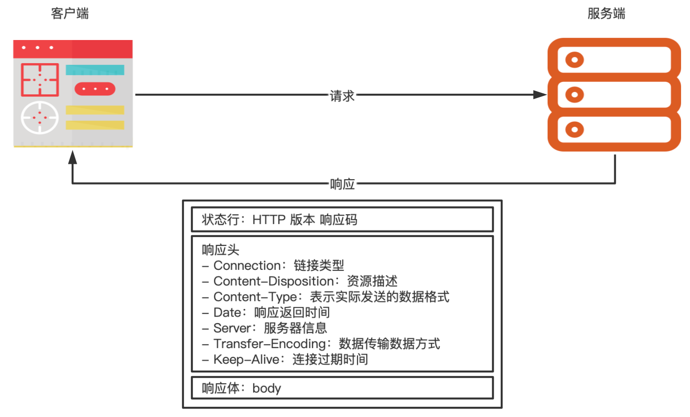

#### HTTP 响应状态码

* 1xx 临时响应，表示通知信息，请求收到了或正在进行处理
* 2xx 表示成功，接受或知道了
  * 200 成功
* 3xx 表示重定向，要完成请求还必须才去进一步的行动
  * 301 永久移动
  * 302 临时移动
* 4xx 表示客户端请求错误
  * 403 未授权
  * 404 未找到
* 5xx 表示服务端错误
  * 500 服务器内部错误
  * 503 服务不可用

#### RESTful

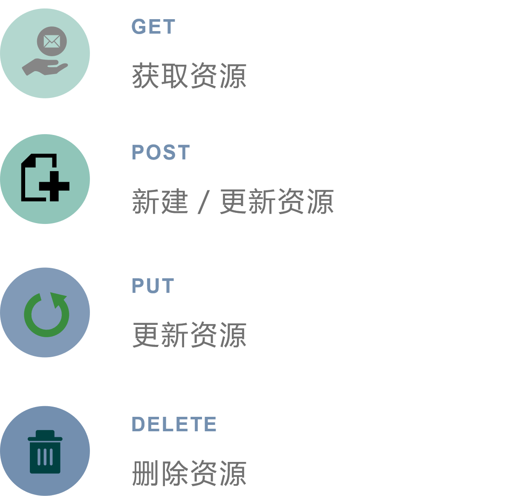

#### 接口测试流程

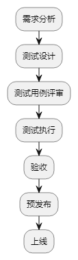

#### 接口测试用例设计思路

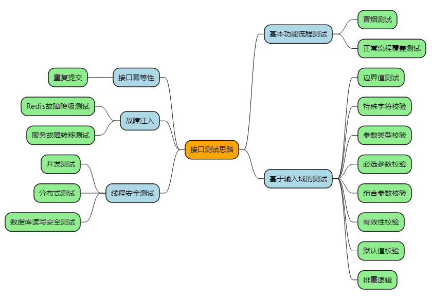

#### 接口测试用例要素

* 用例名称
* 接口地址
* 请求方式
* 前置条件
* 请求头部
* 请求参数
* 响应状态码
* 预期响应结果

### Postman

#### Postman 介绍

* 可视化界面
* 提供响应结果的比较功能
* 查看测试结果
* 批量运行
* 设置环境变量

**Postman 页面**

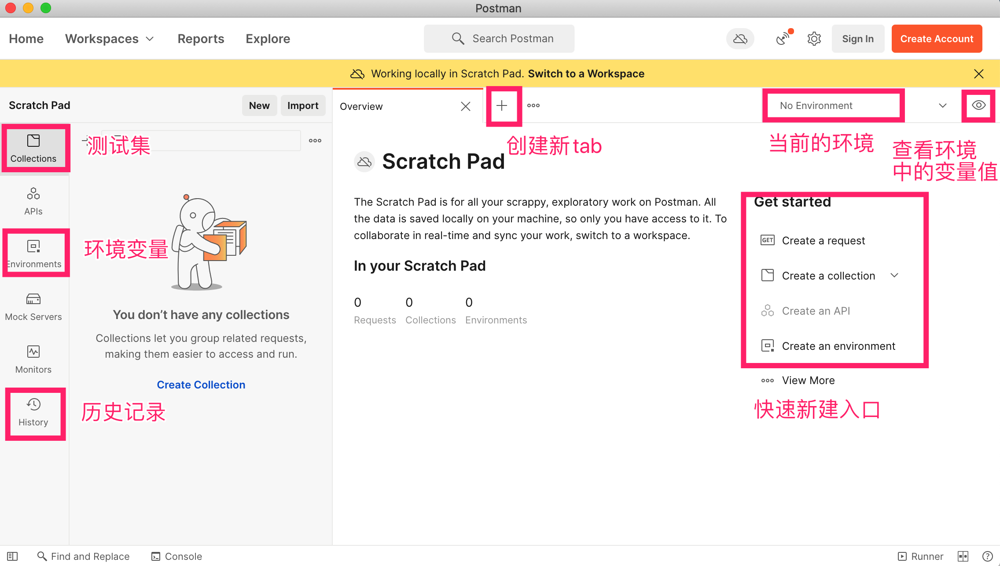

**Postman 完成接口测试**

* 创建测试集
* 编写断言
* 运行测试集
* 查看测试结果

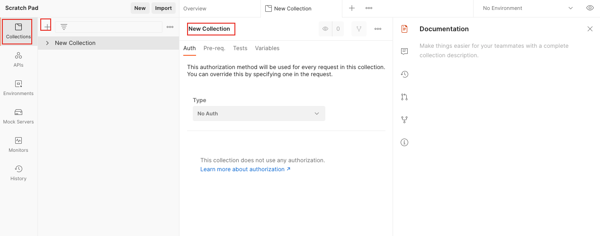