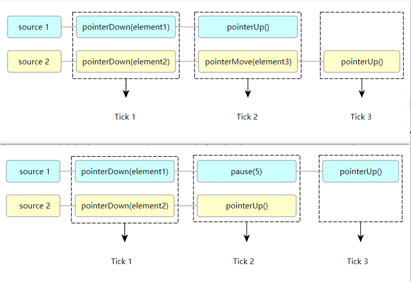

## 用户端App自动化测试2

### Capabilities 进阶

**deviceName**

* 只是设备的名字，别名
* 随便起
* 不能锁定唯一一个设备

**uid**

* 多设备选择的时候，要指定uid
* 默认读取设备列表的第一个设备
* 设备列表获取 adb devices

**newCommandTimeout**

* appium程序应等待来自客户端的新命令多长时间
* 超时后==会话删除==
* 默认60秒
* 设置为0 禁用

**autoGrantPermissions**

* 授予启动的应用程序某些权限

**PRINT_PAGE_SOURCE_ON_FIND_FAILURE**

* 默认为false
* 发生任何错误，强制服务器将实际的 XML 页面源转储到日志中.

**noReset**

* 默认为false
* 安卓true
* 不停止应用程序
* 不清除应用程序数据
* 不卸载 apk

**fullReset**

* 默认为false。true:新会话之前完全卸载被测应用程序
* 安卓
  * 在会话开始之前（appium启动app）和测试之后停止应用程序
  * 清除应用程序数据并卸载 apk

**dontStopAppOnReset**

* 默认为false。
* 不希望应用程序在运行时重新启动，设置为true ``` #打开的app退出后重新启动 adb shell am start -S 包名/activity名
* #打开的app不需要退出，直接使用当前页面 adb shell am start 包名/activity名 ```

### 高阶定位-Xpath

#### xpath函数

**包含-contains()**

* Xpath 表达式中的一个函数
* contains()函数匹配==属性值==中包含的==字符串== //*[contains(@属性,"属性值")]

* contains() 函数定位的元素很容易为 list
* contains() 函数内的属性名需要用 @开始

#### XPath轴

**父子-当前节点的父节点**

```angular2html
//*[@text="HK"]/..

//*[@text="HK"]/parent::*
```

**父子-当前节点的子节点**

```angular2html
//*[@resource-id="com.xueqiu.android:id/stock_layout"]/child::*
```

**爷孙-当前节点的爷爷**

```angular2html
当前节点的父级的父级 ``` //*[@text="HK"]/../..

//[@text="HK"]/parent::/parent::* ```
```

**爷孙-当前节点的孙子**

```angular2html
//*[@resource-id="com.xueqiu.android:id/stock_layout"]/child::*/child::*
```

**祖先-ancestor**

* 返回当前节点的所有祖先
```angular2html
//*[@text="HK"]/ancestor::android.widget.RelativeLayout
```

* 显式指定要返回的祖先 
```angular2html
//*[@text="HK"]/ancestor::android.widget.RelativeLayout[1]
```

**兄弟姐妹-sibling**

**following-sibling**

* 选择当前节点之后的所有兄弟节点
* 节点后有一个兄弟节点 `//*[@text="HK"]/following-sibling::*`
* 节点后有多个兄弟节点 `//*[@resource-id="com.xueqiu.android:id/stock_layout"]/following-sibling::*[@resource-id="com.xueqiu.android:id/price_layout"]`

**preceding-sibling**

* 选择当前节点之前的所有兄弟节点
* 节点前有一个兄弟节点 `//*[@text="09988"]/preceding-sibling::*`
* 节点前有多个兄弟节点`//*[@resource-id="com.xueqiu.android:id/add_attention"]/preceding-sibling::*[@resource-id="com.xueqiu.android:id/price_layout"]`

#### XPath 运算符

**AND**

* 可以在 XPath 表达式中放置 2 个条件
* 在 AND 两个条件都应该为真的情况下，才能找到元素
`//*[@resource-id="com.xueqiu.android:id/current_price" and @text="107.8"]`

**OR**

* 可以在 XPath 表达式中放置 2 个条件
* 在 OR 的情况下，两个条件中的任何一个为真，就可找到元素。
* OR 定位获取的是并集 
`//*[@resource-id="com.xueqiu.android:id/tv_stock_add_follow" or @text="加自选"]`

### 特殊控件 Toast

#### Toast 是什么

* 一种消息框类型
* 永远不会获得焦点
  * 无法被点击
* Toast显示的时间有限，Toast会根据用户设置的显示时间后自动消失
* 是系统级别的控件，属于系统settings
* Toast类的思想：
  * 就是尽可能不引人注意，同时还向用户显示信息，希望他们看到

#### Toast 定位

* appium 用的是uiautomator底层来抓取toast，
* 再把toast放到控件树内，但是它本身不属于空间
* 使用的是uiautomator2

xpath 可以找到```//*[@class="android.widget.Toast"]
//*[contains(@text,"xxx")] ``` xxx：toast的文本内容
```angular2html
driver.manage().timeouts().implicitlyWait(Duration.ofSeconds(50));  
driver.findElement(AppiumBy.xpath("//*[@class=\"android.widget.Toast\"]"));
```

### 显示等待

* 必须：每个需要等待的元素前面进行声明
* 针对的是某个条件的等待时间，在设置的时间内，可以默认每隔段时间也可以指定每隔多久去检查一次条件是否满足
* 默认的检测频率0.5s。

#### 显示等待声明

* WebDriver
  * 当前的driver驱动 AndroidDriver 、ChromeDriver
* timeout
  * 显示等待的总时间，最长超时时间
* sleeper
  * 每隔多久就去找一下对应的显示等待的条件
  * 检查显示等待条件的间隔步长
  * 默认500ms
* TimeoutException
  * 默认抛出的异常
**示例:**
```angular2html
new WebDriverWait(driver,Duration.ofSeconds(20),Duration.ofSeconds(2)).until(  
        //等待条件
);
```

#### 显示等待传入条件

* until( //等待条件);
  * 等待期间，每隔一段时间「sleeper」就会调一下等待条件，直到返回值不是false

#### 显示等待传入报错message

* withMessage("报错message")
  * 返回值false对应的报错信息

#### ExpectedConditions

* 元素是否存在
  * presenceOfElementLocated
  * 元素在页面是否存在，不一定显示可见，只要在dom树存在即可。
  * 如果元素存在，则返回true
  * `ExpectedConditions.presenceOfElementLocated(AppiumBy.xpath(""))`
* 元素是否可见
  * visibilityOfElementLocated
  * 元素在页面是否可以肉眼可见
  * `ExpectedConditions.visibilityOfElementLocated(AppiumBy.xpath(""))`
* 元素是否不可见
  * invisibilityOfElementLocated
  * 与visibilityOfElementLocated相反
  * `ExpectedConditions.invisibilityOfElementLocated(AppiumBy.xpath(""))`
* 元素是否可点击
  * elementToBeClickable
  * 如果元素可以点击，则返回true
  * `ExpectedConditions.elementToBeClickable(AppiumBy.xpath(""))`

#### Lambda

* 直接使用另声明一个driver
* 不用lambda方式声明
```angular2html
Function<WebDriver, Object> function = new Function<>() {  
    @Override  
    public Object apply(WebDriver webDriver) {  
        return webDriver.findElement(hot);  
    }  
};  

FluentWait<WebDriver> withMessage = webDriverWait.withMessage("查找失败");  

withMessage.until(function);
```

* lambda简写

```angular2html
webDriverWait.withMessage("lambda查找失败").until(  
      webDriver -> webDriver.findElement(hot)  
);
```

#### 等待总结
* 隐式等待
  * driver声明以后添加
  * 添加一次，全局生效
  * 一般时间限制在==15s-30s==
* 显示等待
  * 处理隐式等待无法解决的问题
    * 文件上传「时间可以设置长一些，文件上传一般需20s以上」
* 强制等待
  * 不建议使用

###  高级控件交互方法

#### Actions

* 执行一系列或多个键盘和指针（触摸、鼠标、触控笔）操作链

#### w3c

**W3C 事件流**



#### 用法

* 定义 ActionChains 实例
* 定义输入源
* 定义动作

```angular2html
# 定义ActionChains 实例
actions = ActionChains(driver)
# 第一步：定义输入源
# ActionChains里有个属性是ActionBuilder类型的， 使用的就是w3c协议
# 可以定义鼠标指针源，键盘源，滚轮源事件
actions.w3c_actions = ActionBuilder(driver, mouse=PointerInput(interaction.POINTER_TOUCH, "touch"))
# 第二步：定义动作
# 移动到起点-> 按下-> 滑动-> 抬起
actions.w3c_actions.pointer_action.move_to_location(115, 183)
actions.w3c_actions.pointer_action.pointer_down()
actions.w3c_actions.pointer_action.move_to_location(362, 179)
actions.w3c_actions.pointer_action.release()
actions.perform()
```