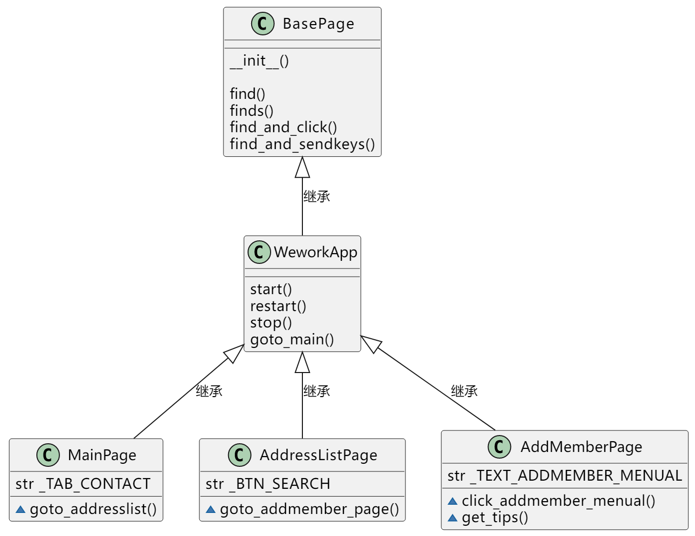
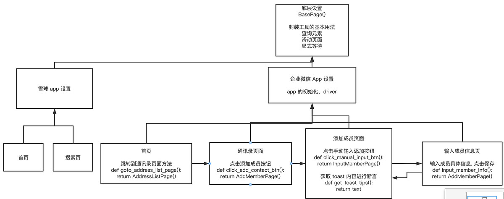

## 用户端App自动化测试3

### PO设计原则

**属性意义**

* 不需要暴露页面内容的元素给外部
* 不需要把页面内所有的元素一次性全部建模

**方法意义**

* 用公共方法代表页面提供的功能
* 方法都应该返回要跳转的页面，或者用来断言的数据
* 同样的行为不同的结果需要建模为不同的方法
* 不要在页面的方法中加断言

#### PO 封装思路




* 分三层模块
* 对象库层、操作层、业务层。
```angular2html
1.对象库层BasePage 封装工具基本用法:查询元素,滑动页面,显式等待等  

2.操作层BaseDriver 封装页面操作的基本方法:
app的初始化:打开,关闭,返回
设备连接配置:
app的全局配置:手机的设备号,启动的报名,登录的账号密码等

3.业务层Page 继承操作层,分多个页面,return 断言的结果或者页面

4.测试用例:
将app实例化
调用所需要页面对象中的行为，链式调用组成测试用例
测试用例中，只需要含有页面函数的调用和断言，不应该出现元素定位等其他的操作，如果写测试用例中出现需要其他的额外的操作，可以想办法封装到页面对象或者元素定位中
```

```angular2html
Hogwarts $ tree
.
├── __init__.py
├── base
│ ├── __init__.py
│ ├── app.py
│ └── base_page.py
├── cases
│ ├── __init__.py
│ └── test_xxx.py
├── log
│ ├── test.log
├── datas
│ └── xxx.yml
├── page
│ ├── __init__.py
│ ├── main_page.py
│ ├── xxx_page.py
│ └── xxx_page.py
├── pytest.ini
└── utils
    ├── __init__.py
    └── log_utils.py
```


